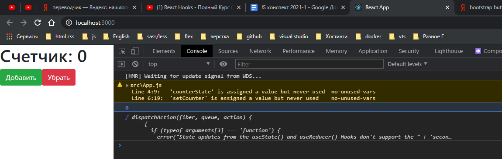

Функциональные компоненты.

Хуки это изолированные функции. Они позволяют польностью имплимитировать весь функционал **react** в базовых компонентах.

Базовый **hook useState()** он предназначен для того что бы взаимодействовать со **state**. Для того что бы продемомстрировать возможности напишу небольшое приложение.

```jsx
import React from 'react';

function App() {
  return (
    <div>
      <h1>Счетчик</h1>
      <button className="btn btn-success">Добавить</button>
      <button className="btn btn-danger">Убрать</button>
    </div>
  );
}

export default App;
```


И для того что бы начать работать со счетчиком мне нужно ввести некоторое состояние. Сам **hook** мы можем получить из объекта **React** и вызвать у него метод **useState()**

```jsx
import React from 'react';

function App() {
  React.useState();

  return (
    <div>
      <h1>Счетчик</h1>
      <button className="btn btn-success">Добавить</button>
      <button className="btn btn-danger">Убрать</button>
    </div>
  );
}

export default App;
```

Но обычно его используют иным способом. Достаем отдельно этот хук. И потом использую просто как обычную функцию.

```jsx
import React, { useState } from 'react';

function App() {
  useState();

  return (
    <div>
      <h1>Счетчик</h1>
      <button className="btn btn-success">Добавить</button>
      <button className="btn btn-danger">Убрать</button>
    </div>
  );
}

export default App;
```

Как параметр в данную функцию мы передаем начальное состояние. И например это будет ноль.

```jsx
import React, { useState } from 'react';

function App() {
  const counterState = useState(0);

  return (
    <div>
      <h1>Счетчик</h1>
      <button className="btn btn-success">Добавить</button>
      <button className="btn btn-danger">Убрать</button>
    </div>
  );
}

export default App;
```

Если мы посмотрим в консоли что такое у нас **counterState**.

```jsx
import React, { useState } from 'react';

function App() {
  const counterState = useState(0);

  console.log(counterState);

  return (
    <div>
      <h1>Счетчик</h1>
      <button className="btn btn-success">Добавить</button>
      <button className="btn btn-danger">Убрать</button>
    </div>
  );
}

export default App;
```


Первый элемент массива непосредственно само состояние, а второй элемент массива это функция. Функция которая позволяет изменять это состояние. Функция **useState** нам возвращает кортеж. Кортеж это массив с заранее определенными элементами. Где первый элемент т.е. по индексу ноль. Это непосредственно сам **state** который мы должны определять в сам шаблон **console.log(counterState[0]);** А второй элемент кортежа **console.log(counterState[1]);**

```jsx
import React, { useState } from 'react';

function App() {
  const counterState = useState(0);

  console.log(counterState[0]);
  console.log(counterState[1]);

  return (
    <div>
      <h1>Счетчик</h1>
      <button className="btn btn-success">Добавить</button>
      <button className="btn btn-danger">Убрать</button>
    </div>
  );
}

export default App;
```

это функция позволяющая изменять этот **state** для того что бы **react** смог отследить я то **state** изменился и соответсвенно перерисовать шаблон. Для того что бы на прямую не меняли непосредственно данное сосотяние **console.log(counterState[0]);**

Безусловно каждый раз пасать вот таким образом не очень удобно. И по этому практически всегда мы будем видить другую запись. Мы сразу делаем деструктуризацию массива и учитывая что мы знаем сколько элементов он нам вернет, то мы сразу же заносим их в определенные переменные. Первая переменная это непосредственно само состояние, и вторая переменная это функция позволяющая изменить этот счетчик. Обычно ее называют с префиксом **set**

```jsx
import React, { useState } from 'react';

function App() {
  const [counter, setCounter] = useState(0);

  console.log(counter);
  console.log(setCounter);

  return (
    <div>
      <h1>Счетчик: {counter}</h1>
      <button className="btn btn-success">Добавить</button>
      <button className="btn btn-danger">Убрать</button>
    </div>
  );
}

export default App;
```



Теперь оживляю кнопки для того что бы они изменяли наше состояние. И для этого добавляю обработчик события **onClick**. И в нем например в случае добавить я буду вызывать метод **increment**.

```jsx
import React, { useState } from 'react';

function App() {
  const [counter, setCounter] = useState(0);

  console.log(counter);
  console.log(setCounter);

  return (
    <div>
      <h1>Счетчик: {counter}</h1>
      <button onClick={increment} className="btn btn-success">
        Добавить
      </button>
      <button className="btn btn-danger">Убрать</button>
    </div>
  );
}

export default App;
```

Что является методом в случае с функциональными компонентами? На самом деле в **JS** мы можем создавать функции внутри других функций. **increment** я передаю как **reference** в атрибут **onClick**.

Кода описываю данную функция я делаю все что хочу. В данной функции я вызываю мектод **setCounter** который позволяет изменять состояние и сказать на что мне необходимо его изменить.

```jsx
import React, { useState } from 'react';

function App() {
  const [counter, setCounter] = useState(0);

  function increment() {
    setCounter(counter + 1);
  }

  return (
    <div>
      <h1>Счетчик: {counter}</h1>
      <button onClick={increment} className="btn btn-success">
        Добавить
      </button>
      <button className="btn btn-danger">Убрать</button>
    </div>
  );
}

export default App;
```

По аналогии я могу создать функции **decrement**

```jsx
import React, { useState } from 'react';

function App() {
  const [counter, setCounter] = useState(0);

  function increment() {
    setCounter(counter + 1);
  }

  function decrement() {
    setCounter(counter - 1);
  }

  return (
    <div>
      <h1>Счетчик: {counter}</h1>
      <button onClick={increment} className="btn btn-success">
        Добавить
      </button>
      <button onClick={decrement} className="btn btn-danger">
        Убрать
      </button>
    </div>
  );
}

export default App;
```


Код здесь намного лаконичнее потому что мы нигде не пишем **this.setState** и т.д.

Поговорим про его более продвинутое использование. Конечно конвенцией и хорошей практикоя вляется когда мы определяем какое либо состояние прямо когда стартует компонент т.е. на верху функционального компонента.

Чего мы делать не можем. Мы не можем например в блоке **if** создавать какое -то состояние


И действительно такоз записи быть не должно т.е. если мы хотим создать состяние, то мы создаем его прямо на верху компонента.

Как вы заметили я могу вызывать функцию **useState** сколько угодно раз т.е. сколько состяний я хочу создать столько раз я могу вызывать эту функцию.

Нюансы:

Хук работает асинхронно. Это влиет на что что например в функции **increment** мы хотим например не один раз увеличить **counter** а двара увеличить.

```jsx
import React, { useState } from 'react';

function App() {
  const [counter, setCounter] = useState(0);

  function increment() {
    setCounter(counter + 1);
    setCounter(counter + 1);
  }

  function decrement() {
    setCounter(counter - 1);
  }

  return (
    <div>
      <h1>Счетчик: {counter}</h1>
      <button onClick={increment} className="btn btn-success">
        Добавить
      </button>
      <button onClick={decrement} className="btn btn-danger">
        Убрать
      </button>
    </div>
  );
}

export default App;
```

Счетчик все равно увеличивается на еденицу. Потому что когда мы вызываем функцию **setCounter** с состоянием **counter** мы увеличиваем его на еденицу должен произойти цикл рендеринга для того что бы сам **counter** изменился. Когда мы паралельно вызываем еще один **counter** то значение в нем остается что и было до этого.

Для того что бы решить данную проблему. Функция **setCounter** может по другому принимать изменение **state** т.е. мы можем **setCounter()** передавать не какое-то значение, которое будет заненсено в сам **state**. Она может в себя принимать **callback** функцию. Данная колбэк функция принимает в себя предыдущее состояние. Можно назвать как **prevCounter**. Дальше необходимо вернуть из этой функции какое-то новое состояние, которое будет использовать предыдущее состояние

```jsx
import React, { useState } from 'react';

function App() {
  const [counter, setCounter] = useState(0);

  function increment() {
    // setCounter(counter + 1);
    // setCounter(counter + 1);
    setCounter((prevCounter) => {
      return prevCounter + 1; // предыдущее состояние +1 т.е. счетчик будет все время увеличиваться на 2
    });
    setCounter((prev) => prev + 1);
  }

  function decrement() {
    setCounter(counter - 1);
  }

  return (
    <div>
      <h1>Счетчик: {counter}</h1>
      <button onClick={increment} className="btn btn-success">
        Добавить
      </button>
      <button onClick={decrement} className="btn btn-danger">
        Убрать
      </button>
    </div>
  );
}

export default App;
```

это

```jsx
setCounter((prev) => prev + 1);
```

Аналогично этому

```jsx
setCounter((prevCounter) => {
  return prevCounter + 1; // предыдущее состояние +1 т.е. счетчик будет все время увеличиваться на 2
});
```


В этом и заключается идея. Если вы точно хотите основываться на том состоянии которое было до этого, что бы небыло ни каких багов , то пложой практикой является изменение **state** является через **callback** основываясь на предыдущем состоянии.

Еще одна особенность. Например если мы получаем состояние не просто как какое-то состояние, а мы хотим его вычеслить. Для этого я создаю фуункцию **computerInitialCounter(){}**

```jsx
import React, { useState } from 'react';

computerInitialCounter(){}

function App() {
  const [counter, setCounter] = useState(0);

  function increment() {
    // setCounter(counter + 1);
    // setCounter(counter + 1);
    setCounter((prevCounter) => {
      return prevCounter + 1; // предыдущее состояние +1 т.е. счетчик будет все время увеличиваться на 2
    });
    setCounter((prev) => prev + 1);
  }

  function decrement() {
    setCounter(counter - 1);
  }

  return (
    <div>
      <h1>Счетчик: {counter}</h1>
      <button onClick={increment} className="btn btn-success">
        Добавить
      </button>
      <button onClick={decrement} className="btn btn-danger">
        Убрать
      </button>
    </div>
  );
}

export default App;
```

Это функция которая будет делать некоторые вычисления

```jsx
import React, { useState } from 'react';

function computerInitialCounter() {
  console.log('Some calculations.....');
  return Math.trunc(Math.random() * 20);
}

function App() {
  const [counter, setCounter] = useState(computerInitialCounter());

  function increment() {
    // setCounter(counter + 1);
    // setCounter(counter + 1);
    setCounter((prevCounter) => {
      return prevCounter + 1; // предыдущее состояние +1 т.е. счетчик будет все время увеличиваться на 2
    });
    setCounter((prev) => prev + 1);
  }

  function decrement() {
    setCounter(counter - 1);
  }

  return (
    <div>
      <h1>Счетчик: {counter}</h1>
      <button onClick={increment} className="btn btn-success">
        Добавить
      </button>
      <button onClick={decrement} className="btn btn-danger">
        Убрать
      </button>
    </div>
  );
}

export default App;
```

Здесь нет ни какого сокрального смысла. Для того что бы просто получить это состояние мы просто будем его вычислять. Любые вычисления связаны с производительностью. Учитывая что функция нам возвращает некоторе значение, то это и будет начальное значение для нашего **counter**.


Каждый раз при обновлении страницы рандомно меняется стартовое значение.

Если взлянуть то можно обнаружить что при клике на кнопку данная функция вызывается два раза. Кароче говоря она будет тормозить приложение. Данная функция вызыватеся второй раз потому что мы заново рендерим страницу. Для того что бы оптимизировать данный процесс в хук **useState** мы можем передавать функцию которая один раз вычислит это значение и уже не будет сюда обращаться. Т.е. при инициализации **state**

```jsx
import React, { useState } from 'react';

function computerInitialCounter() {
  console.log('Some calculations.....');
  return Math.trunc(Math.random() * 20);
}

function App() {
  const [counter, setCounter] = useState(() => {
    return computerInitialCounter();
  });

  function increment() {
    // setCounter(counter + 1);
    // setCounter(counter + 1);
    setCounter((prevCounter) => {
      return prevCounter + 1; // предыдущее состояние +1 т.е. счетчик будет все время увеличиваться на 2
    });
    setCounter((prev) => prev + 1);
  }

  function decrement() {
    setCounter(counter - 1);
  }

  return (
    <div>
      <h1>Счетчик: {counter}</h1>
      <button onClick={increment} className="btn btn-success">
        Добавить
      </button>
      <button onClick={decrement} className="btn btn-danger">
        Убрать
      </button>
    </div>
  );
}

export default App;
```


И последний момент. **useState()** взаимодействие с объектами. Потому что здесь есть некоторые отличия от классовых компонентов.

Создаю **useState** как объект. И состоянием здесь может быть что угодно.

```jsx
import React, { useState } from 'react';

function computerInitialCounter() {
  console.log('Some calculations.....');
  return Math.trunc(Math.random() * 20);
}

function App() {
  const [counter, setCounter] = useState(() => {
    return computerInitialCounter();
  });

  const [state, setState] = useState({
    title: 'Счетчик',
    date: Date.now(),
  });

  function increment() {
    // setCounter(counter + 1);
    // setCounter(counter + 1);
    setCounter((prevCounter) => {
      return prevCounter + 1; // предыдущее состояние +1 т.е. счетчик будет все время увеличиваться на 2
    });
    setCounter((prev) => prev + 1);
  }

  function decrement() {
    setCounter(counter - 1);
  }

  return (
    <div>
      <h1>Счетчик: {counter}</h1>
      <button onClick={increment} className="btn btn-success">
        Добавить
      </button>
      <button onClick={decrement} className="btn btn-danger">
        Убрать
      </button>
    </div>
  );
}

export default App;
```

И как использовать данное состояние?

Для упрощения я это все выведу в блок **pre**

```jsx
import React, { useState } from 'react';

function computerInitialCounter() {
  console.log('Some calculations.....');
  return Math.trunc(Math.random() * 20);
}

function App() {
  const [counter, setCounter] = useState(() => {
    return computerInitialCounter();
  });

  const [state, setState] = useState({
    title: 'Счетчик',
    date: Date.now(),
  });

  function increment() {
    // setCounter(counter + 1);
    // setCounter(counter + 1);
    setCounter((prevCounter) => {
      return prevCounter + 1; // предыдущее состояние +1 т.е. счетчик будет все время увеличиваться на 2
    });
    setCounter((prev) => prev + 1);
  }

  function decrement() {
    setCounter(counter - 1);
  }

  return (
    <div>
      <h1>Счетчик: {counter}</h1>
      <button onClick={increment} className="btn btn-success">
        Добавить
      </button>
      <button onClick={decrement} className="btn btn-danger">
        Убрать
      </button>
      <pre>{JSON.stringify(state, null, 2)}</pre>
    </div>
  );
}

export default App;
```


И теперь мы видим как выглядит наше состояние. Теперь допустим добавим кнопку которая позволит изменять **title**. и в методе **onClick** вызываю **callback** с помощью которого возвращаю состояние. Раньше мы делали вот так

```jsx
import React, { useState } from 'react';

function computerInitialCounter() {
  console.log('Some calculations.....');
  return Math.trunc(Math.random() * 20);
}

function App() {
  const [counter, setCounter] = useState(() => {
    return computerInitialCounter();
  });

  const [state, setState] = useState({
    title: 'Счетчик',
    date: Date.now(),
  });

  function increment() {
    // setCounter(counter + 1);
    // setCounter(counter + 1);
    setCounter((prevCounter) => {
      return prevCounter + 1; // предыдущее состояние +1 т.е. счетчик будет все время увеличиваться на 2
    });
    setCounter((prev) => prev + 1);
  }

  function decrement() {
    setCounter(counter - 1);
  }

  return (
    <div>
      <h1>Счетчик: {counter}</h1>
      <button onClick={increment} className="btn btn-success">
        Добавить
      </button>
      <button onClick={decrement} className="btn btn-danger">
        Убрать
      </button>
      <button
        onClick={() => setState({ title: 'Новое значение' })}
        className="btn btn-default"
      >
        Изменить название
      </button>
      <pre>{JSON.stringify(state, null, 2)}</pre>
    </div>
  );
}

export default App;
```


Название меняется но при этом пропадает **date**. Это происходит постому что когда мы используем **state** ввиде объекта в функциональных объектах. Если мы передаем в **onClick** какой-то новый объект, то он заменяется полность т.е. от не совмещается с предыдущим состоянием, он полностью меняется на то что мы передали. Это большое отличие склассовыми компонентами.

Для того что бы исправить данную ситуацию. Сначало вывожу все это в отдельную функцию **updateTitle**

```jsx
import React, { useState } from 'react';

function computerInitialCounter() {
  console.log('Some calculations.....');
  return Math.trunc(Math.random() * 20);
}

function App() {
  const [counter, setCounter] = useState(() => {
    return computerInitialCounter();
  });

  const [state, setState] = useState({
    title: 'Счетчик',
    date: Date.now(),
  });

  function increment() {
    // setCounter(counter + 1);
    // setCounter(counter + 1);
    setCounter((prevCounter) => {
      return prevCounter + 1; // предыдущее состояние +1 т.е. счетчик будет все время увеличиваться на 2
    });
    setCounter((prev) => prev + 1);
  }

  function decrement() {
    setCounter(counter - 1);
  }

  function updateTitle() {
    // Возвращаю предыдущее состояние и только после этого меняю
    setState((prev) => {
      return {
        ...prev,
        title: 'Новое названние',
      };
    });
  }

  return (
    <div>
      <h1>Счетчик: {counter}</h1>
      <button onClick={increment} className="btn btn-success">
        Добавить
      </button>
      <button onClick={decrement} className="btn btn-danger">
        Убрать
      </button>
      <button onClick={updateTitle} className="btn btn-default">
        Изменить название
      </button>
      <pre>{JSON.stringify(state, null, 2)}</pre>
    </div>
  );
}

export default App;
```


Это тот способ который позволяет взаимодействовать с объектами. Но такое встречается редко. Например было бы проще разбить это на два состояния т.е. два раза вызвать **useState** для **title** и для **date**. Т.е. былбы **title** и **setTitle** и **date** и **setDate**.
