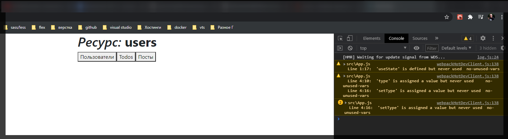
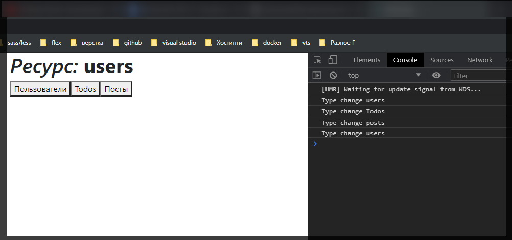

# useEffect

Это один из самых основных хуков. Плюс в процессе мы будем тренировать все то что проходили до этого. Создаю папку **exemples** где буду хранить предыдущий код.

Создаю новый **state** с помощью функции **useState** которая будет называться **users**. **State** я назову **type** и функция позволяющая его изменить будет **setType**

```jsx
import React, { useState } from 'react';

function App() {
  const [type, setType] = useState('users');

  return (
    <div>
      <h1>Ресурс{type}</h1>

      <button onClick={() => setType('users')}>Пользователи</button>
      <button onClick={() => setType('Todos')}>Todos</button>
      <button onClick={() => setType('posts')}>Посты</button>
    </div>
  );
}

export default App;
```

Как мы видим это абсолютно базовое использование хука **useState()**.




И теперь вернемся к тому что же такое **useEffect**. Импортирую его. И использование у него довольно простое. Он в себя принимает **callback**.

```jsx
import React, { useState, useEffect } from 'react';

function App() {
  const [type, setType] = useState('users');

  useEffect(() => {});

  return (
    <div>
      <h1>
        <em>Ресурс:</em> <b>{type}</b>
      </h1>

      <button onClick={() => setType('users')}>Пользователи</button>
      <button onClick={() => setType('Todos')}>Todos</button>
      <button onClick={() => setType('posts')}>Посты</button>
    </div>
  );
}

export default App;
```

Если мы используем **useEffect** именно таким способом, то он будет выываться каждый раз когда у нас происходит рендер компонента. Мы можем посмотреть на это вывести в консоль просто **render**.

```jsx
import React, { useState, useEffect } from 'react';

function App() {
  const [type, setType] = useState('users');

  useEffect(() => {
    console.log('render');
  });

  return (
    <div>
      <h1>
        <em>Ресурс:</em> <b>{type}</b>
      </h1>

      <button onClick={() => setType('users')}>Пользователи</button>
      <button onClick={() => setType('Todos')}>Todos</button>
      <button onClick={() => setType('posts')}>Посты</button>
    </div>
  );
}

export default App;
```


Я каждый раз вызываю метод **render**.

Но если я опять кликаю на **posts** у меня больше не вызывается метод **render**. При этом что интересно если мы добавим глдобально **console.log**.

```jsx
import React, { useState, useEffect } from 'react';

function App() {
  const [type, setType] = useState('users');

  console.log('Component render');

  useEffect(() => {
    console.log('render');
  });

  return (
    <div>
      <h1>
        <em>Ресурс:</em> <b>{type}</b>
      </h1>

      <button onClick={() => setType('users')}>Пользователи</button>
      <button onClick={() => setType('Todos')}>Todos</button>
      <button onClick={() => setType('posts')}>Посты</button>
    </div>
  );
}

export default App;
```


Три раза вызываю метод **render** но когда повторно пытаюсь отрендерить то вызывается только метод **Component** **render** и не вызывается **useEffect**. Это то как работает **react**. Это базовый метод с помощью которого мы можем отследить каждый рендеринг компонента.

Есть более часто используемая конструкция при использовании **useEffect** когда мы так же передаем **callback**. И **useEffect** принимает в себя второй параметр который называется **deps[]** сокращенно от **dependencies**. Где в массиве мы указываем от чего должен зависить данный **useEffect**. Т.е. например у нас есть **state** type и мы хотим что бы этот **useEffect** зависил от **type**.

```jsx
import React, { useState, useEffect } from 'react';

function App() {
  const [type, setType] = useState('users');

  console.log('Component render');

  // useEffect(() => {
  //   console.log('render');
  // });

  useEffect(() => {}, [type]);

  return (
    <div>
      <h1>
        <em>Ресурс:</em> <b>{type}</b>
      </h1>

      <button onClick={() => setType('users')}>Пользователи</button>
      <button onClick={() => setType('Todos')}>Todos</button>
      <button onClick={() => setType('posts')}>Посты</button>
    </div>
  );
}

export default App;
```

По сути мы здесь говорим что этот **callback** нужно вызывать только в том случае ели **state type** у нас изменился. При других рендерах делать этого не нужно. Вывожу в консоль.

```jsx
import React, { useState, useEffect } from 'react';

function App() {
  const [type, setType] = useState('users');

  console.log('Component render');

  // useEffect(() => {
  //   console.log('render');
  // });

  useEffect(() => {
    console.log('Type change', type);
  }, [type]);

  return (
    <div>
      <h1>
        <em>Ресурс:</em> <b>{type}</b>
      </h1>

      <button onClick={() => setType('users')}>Пользователи</button>
      <button onClick={() => setType('todos')}>Todos</button>
      <button onClick={() => setType('posts')}>Посты</button>
    </div>
  );
}

export default App;
```




Если дважды пытаюсь вызвать один и тот же компонент то рендеринг не происходит. Если переключаюсь между элементами то все норм. Если **type** не изменился, а при повторном вызове он и не меняется, то перерендеринг не происходит.

Как вообще это можно применить? И почему я их специально создал **users**, **todos**, **posts** и т.д.

Зайдем на сервис **JSONPlaceholder** [https://jsonplaceholder.typicode.com/](https://jsonplaceholder.typicode.com/) и например здесь мы можем сделать асинхронный запрос с помощью вот такой конструкции.


```jsx
fetch('https://jsonplaceholder.typicode.com/todos/1')
  .then((response) => response.json())
  .then((json) => console.log(json));
```

Если мы посмотрим чуть ниже то мы увидим типы которые мы задавали в **state**.


Соответственно когда меняется тип мы хотим загружать новый набор данных. Вставляю запрос и немного корректирую его. Т.е. в адресе запроса меняю статический **todos** на **templete** **strings**, т.е. поменяй на шаблонную строку, для того что бы можно было писать шаблонизацию и прописываю **${type}** и удаляю. И дальше в **then** хочу вывести это все. Для этого ноужно завести новый **state** по умолчанию называю его **date**. И когда к нам прилетает новый **json** то я вызываю **setData(json)**

После чего вывожу эти данные на страницу. В теге pre обращаюсь к **JSON.stringify** вывожу данные с двумя сохраненными пробелами.

```jsx
import React, { useState, useEffect } from 'react';

function App() {
  const [type, setType] = useState('users');
  const [data, setData] = useState([]);

  // console.log('Component render');

  // useEffect(() => {
  //   console.log('render');
  // });

  useEffect(() => {
    fetch(`https://jsonplaceholder.typicode.com/${type}`)
      .then((response) => response.json())
      .then((json) => setData(json));
  }, [type]);

  return (
    <div>
      <h1>
        <em>Ресурс:</em> <b>{type}</b>
      </h1>

      <button onClick={() => setType('users')}>Пользователи</button>
      <button onClick={() => setType('Todos')}>Todos</button>
      <button onClick={() => setType('posts')}>Посты</button>

      <pre>{JSON.stringify(data, null, 2)}</pre>
    </div>
  );
}

export default App;
```


А постов вообще больше всего что на страницу не влазят. Теперь мы видим как нам прилетают новые данные.

Резюмируя. **useEffect()** служит для определенных **site** эффектов. Мы можем за чем-то наблюдать и выполнять определенную логику.

С помощью **useEffect()** мы можем эмулировать некоторые **life sycle hook** т.е. например мы можем съэмулировать тот момент когда компонент полностью зарендерился и готов к работе. Для этого в консоли выведу **ComponentDidMount**, и вторыфм параметром в список зависимостей передаю пустой массив.

```jsx
import React, { useState, useEffect } from 'react';

function App() {
  const [type, setType] = useState('users');
  const [data, setData] = useState([]);

  // console.log('Component render');

  // useEffect(() => {
  //   console.log('render');
  // });

  useEffect(() => {
    fetch(`https://jsonplaceholder.typicode.com/${type}`)
      .then((response) => response.json())
      .then((json) => setData(json));
  }, [type]);

  useEffect(() => {
    console.log('ComponentDidMount');
  }, []);

  return (
    <div>
      <h1>
        <em>Ресурс:</em> <b>{type}</b>
      </h1>

      <button onClick={() => setType('users')}>Пользователи</button>
      <button onClick={() => setType('Todos')}>Todos</button>
      <button onClick={() => setType('posts')}>Посты</button>

      <pre>{JSON.stringify(data, null, 2)}</pre>
    </div>
  );
}

export default App;
```


Вызывается **ComponentDidMount** в тот момент когда компонент готов к работе. Но при этом что бы я не делал больше этот **callback** не вызовется.


И в posts тоже самое

Какие еще есть фишки в **useEffect()**?

Для этого я создаю новый **state**. Назову его **pos**. т.е. **const [pos, setPos] = useState({});** И буду работать с объектом.

```jsx
import React, { useState, useEffect } from 'react';

function App() {
  const [type, setType] = useState('users');
  const [data, setData] = useState([]);
  const [pos, setPos] = useState({
    x: 0,
    y: 0,
  });

  // console.log('Component render');

  // useEffect(() => {
  //   console.log('render');
  // });

  useEffect(() => {
    fetch(`https://jsonplaceholder.typicode.com/${type}`)
      .then((response) => response.json())
      .then((json) => setData(json));
  }, [type]);

  useEffect(() => {
    console.log('ComponentDidMount');
  }, []);

  return (
    <div>
      <h1>
        <em>Ресурс:</em> <b>{type}</b>
      </h1>

      <button onClick={() => setType('users')}>Пользователи</button>
      <button onClick={() => setType('Todos')}>Todos</button>
      <button onClick={() => setType('posts')}>Посты</button>

      {/* <pre>{JSON.stringify(data, null, 2)}</pre> */}
      <pre>{JSON.stringify(pos, null, 2)}</pre>
    </div>
  );
}

export default App;
```

Теперь я хочу что бы при любом перемещении мыши мы изменяли координаты. В теге **pre** я буду показывать позицию.

И теперь осталось повешать слушатель события. Логично добавить слушателя в функцию **useEffect** там где при рендеренге компонента выводится **ComponentDidMount**. И с помощью глобального объекта **window** обращаюсь к **addEventListener** и вешаю событие **mosemove**.

```jsx
import React, { useState, useEffect } from 'react';

function App() {
  const [type, setType] = useState('users');
  const [data, setData] = useState([]);
  const [pos, setPos] = useState({
    x: 0,
    y: 0,
  });

  // console.log('Component render');

  // useEffect(() => {
  //   console.log('render');
  // });

  useEffect(() => {
    fetch(`https://jsonplaceholder.typicode.com/${type}`)
      .then((response) => response.json())
      .then((json) => setData(json));
  }, [type]);

  useEffect(() => {
    console.log('ComponentDidMount');

    window.addEventListener('mousemove', (event) => {
      setPos({
        x: event.clientX,
        y: event.clientY,
      });
    });
  }, []);

  return (
    <div>
      <h1>
        <em>Ресурс:</em> <b>{type}</b>
      </h1>

      <button onClick={() => setType('users')}>Пользователи</button>
      <button onClick={() => setType('Todos')}>Todos</button>
      <button onClick={() => setType('posts')}>Посты</button>

      {/* <pre>{JSON.stringify(data, null, 2)}</pre> */}
      <pre>{JSON.stringify(pos, null, 2)}</pre>
    </div>
  );
}

export default App;
```


Проблема здесь заключается вот в чем. Любые слушатели которые мы добавляем их нужно удалять. Как вообще поять когда удалять слушатель?

Здесь нужно сделать две манипуляции.

Во-первых для того что бы в дальнейшем удалить этот **callback**

```jsx
window.addEventListener('mousemove', (event) => {
      setPos({
        x: event.clientX,
        y: event.clientY,
      });
```

нам необходимо писать его в одном месте. Допустим я назову его **moseMoveHandler** это будет функция где я продублирую то что я написал. После чего эту функцию я передаю как **reference** в вызов события **addEventListenner**.

```jsx
import React, { useState, useEffect } from 'react';

function App() {
  const [type, setType] = useState('users');
  const [data, setData] = useState([]);
  const [pos, setPos] = useState({
    x: 0,
    y: 0,
  });

  // console.log('Component render');

  // useEffect(() => {
  //   console.log('render');
  // });

  useEffect(() => {
    fetch(`https://jsonplaceholder.typicode.com/${type}`)
      .then((response) => response.json())
      .then((json) => setData(json));
  }, [type]);

  const mouseMoveHandler = (event) => {
    setPos({
      x: event.clientX,
      y: event.clientY,
    });
  };

  useEffect(() => {
    console.log('ComponentDidMount');

    window.addEventListener('mousemove', (event) => mouseMoveHandler);
  }, []);

  return (
    <div>
      <h1>
        <em>Ресурс:</em> <b>{type}</b>
      </h1>

      <button onClick={() => setType('users')}>Пользователи</button>
      <button onClick={() => setType('Todos')}>Todos</button>
      <button onClick={() => setType('posts')}>Посты</button>

      {/* <pre>{JSON.stringify(data, null, 2)}</pre> */}
      <pre>{JSON.stringify(pos, null, 2)}</pre>
    </div>
  );
}

export default App;
```

Далее в **useEffect** я могу возвращать функцию которая будет очищать слушателя тогда когда будет заканчиваться действие этого эффекта т.е. по сути я могу написать **window.removeEventListener**.

```jsx
import React, { useState, useEffect } from 'react';

function App() {
  const [type, setType] = useState('users');
  const [data, setData] = useState([]);
  const [pos, setPos] = useState({
    x: 0,
    y: 0,
  });

  // console.log('Component render');

  // useEffect(() => {
  //   console.log('render');
  // });

  useEffect(() => {
    fetch(`https://jsonplaceholder.typicode.com/${type}`)
      .then((response) => response.json())
      .then((json) => setData(json));
  }, [type]);

  const mouseMoveHandler = (event) => {
    setPos({
      x: event.clientX,
      y: event.clientY,
    });
  };

  useEffect(() => {
    console.log('ComponentDidMount');

    window.addEventListener('mousemove', (event) => mouseMoveHandler);

    return () => {
      window.removeEventListener('mousemove', (event) => mouseMoveHandler);
    };
  }, []);

  return (
    <div>
      <h1>
        <em>Ресурс:</em> <b>{type}</b>
      </h1>

      <button onClick={() => setType('users')}>Пользователи</button>
      <button onClick={() => setType('Todos')}>Todos</button>
      <button onClick={() => setType('posts')}>Посты</button>

      {/* <pre>{JSON.stringify(data, null, 2)}</pre> */}
      <pre>{JSON.stringify(pos, null, 2)}</pre>
    </div>
  );
}

export default App;
```

Сейчас мы не увидим действие данного **cleaner** по той причине что мы вызовем ее тогда когда сам компонент будет удаляться т.е. для этого сейчас нужно написать довольно сложную логику.

Но если вернутся к примеру с **type**, то данная очистка будет вызываться всегда когда мы заново заходим в этот **callback**.

```jsx
import React, { useState, useEffect } from 'react';

function App() {
  const [type, setType] = useState('users');
  const [data, setData] = useState([]);
  const [pos, setPos] = useState({
    x: 0,
    y: 0,
  });

  // console.log('Component render');

  // useEffect(() => {
  //   console.log('render');
  // });

  useEffect(() => {
    fetch(`https://jsonplaceholder.typicode.com/${type}`)
      .then((response) => response.json())
      .then((json) => setData(json));

    return () => {
      console.log('clean type');
    };
  }, [type]);

  const mouseMoveHandler = (event) => {
    setPos({
      x: event.clientX,
      y: event.clientY,
    });
  };

  useEffect(() => {
    console.log('ComponentDidMount');

    window.addEventListener('mousemove', (event) => mouseMoveHandler);

    return () => {
      window.removeEventListener('mousemove', (event) => mouseMoveHandler);
    };
  }, []);

  return (
    <div>
      <h1>
        <em>Ресурс:</em> <b>{type}</b>
      </h1>

      <button onClick={() => setType('users')}>Пользователи</button>
      <button onClick={() => setType('Todos')}>Todos</button>
      <button onClick={() => setType('posts')}>Посты</button>

      {/* <pre>{JSON.stringify(data, null, 2)}</pre> */}
      <pre>{JSON.stringify(pos, null, 2)}</pre>
    </div>
  );
}

export default App;
```


Таким образом можно делать различные отписки, удалять слушатель и т.д.
rververvrv
