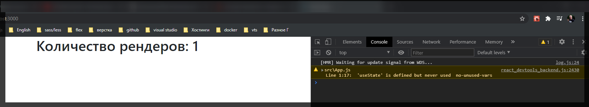
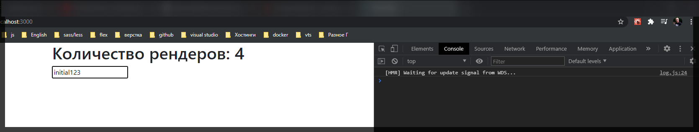

# useRef

**useRef** сам по себе очень похож на то как мы работаем со **state**. Давайте рассмотрим проблематику и в чем заключаются отличия и уже потом перейдем к **hook**.

Допустим у нас есть такая задача посчитать сколько раз мы рендерели наш компонент. И как мы можем сделать это без хука **useRef**?

Я создаю новый **state**

```jsx
import React, { useState, useEffect } from 'react';

function App() {
  const [renderCount, setRenderCount] = useState(1);

  return <div></div>;
}

export default App;
```

Дальше мы знаем что хук **useEffect** без второго параметра вызывается каждый раз когда происходит рендер. И соответственно здесь я могу изменить состояние **setRenderCount** от предыдущего **prev => prev + 1**.

```jsx
import React, { useState, useEffect } from 'react';

function App() {
  const [renderCount, setRenderCount] = useState(1);

  setRenderCount((prev) => prev + 1);

  return (
    <div>
      <h1>Количество рендеров: {renderCount}</h1>
    </div>
  );
}

export default App;
```

если вы очень внимательный разработчик то вы увидите что мы войдем в бесконечный **loop**. У него отрисовывается, а у меня **React** сразу предупредил.

> Error: Too many re-renders. React limits the number of renders to prevent an infinite loop

Это происходит потому что мы изначально попадаем в **useEffect** и меняем **state**, но как только мы меняем **state** таким образом мы так же говорим что компонент нужно перерендерить и поэтому мы снова попадаем в **useEffect** и т.д. Здесь принцып заключается в том что если мы работаем с **useState**, то при изменении данного **state** т.е. **setRenderCount** мы вызываем рендер компонент, в этом его суть, и поэтому под данную задачу данный подход не годится.

Как мы можем данную ситуацию исправить?

Есть такой вариант что мы в не компонента создаем какую-то переменную **renderCount** например равный **1**.

```jsx
import React, { useState, useEffect } from 'react';

let renderCount = 1;

function App() {
  // const [renderCount, setRenderCount] = useState(1);

  useEffect(() => {
    renderCount++;
  });

  return (
    <div>
      <h1>Количество рендеров: {renderCount}</h1>
    </div>
  );
}

export default App;
```



Допишем функционал. Создаю новый **state** **value**. В **button** заношу Изменение стэйта **onChange={(e) => setValue(e.target.value)}** и в сам инпут я буду заносить **value={value}**.
Это базовое использование **input** c хуком **useState()**.

```jsx
import React, { useState, useEffect } from 'react';

let renderCount = 1;

function App() {
  // const [renderCount, setRenderCount] = useState(1);
  const [value, setValue] = useState('initial');

  useEffect(() => {
    renderCount++;
  });

  return (
    <div>
      <h1>Количество рендеров: {renderCount}</h1>
      <input
        type="text"
        onChange={(e) => setValue(e.target.value)}
        value={value}
      />
    </div>
  );
}

export default App;
```

Соответственно при каждом изменении мы будем вызывать функцию **setValue** и соответственно вызывать рендер компонента.


И вот при каждом вводе значения происходит перерендкринг страницы.

Но на самом деле это не очень хороший подход потому что у нас присутствует переменная которая находится вне действия реакта, она находится вне самого компонента и это не совсем правильно.

И здесь для того что бы решить нашу задачу мы можем воспользоваться хуком **useRef** который на самом деле по своей сути так же создает состояние. Он очень похож на **useState**.

Я создаю переменную **renderCount** c помощью хука **useRef()** и сюда мы передаем так же некоторое начальное состояние

```jsx
import React, { useState, useEffect, useRef } from 'react';

let renderCount = 1;

function App() {
  // const [renderCount, setRenderCount] = useState(1);
  const [value, setValue] = useState('initial');
  const renderCount = useRef();

  useEffect(() => {
    renderCount++;
  });

  return (
    <div>
      <h1>Количество рендеров: {renderCount}</h1>
      <input
        type="text"
        onChange={(e) => setValue(e.target.value)}
        value={value}
      />
    </div>
  );
}

export default App;
```

Здесь **const renderCounter = useRef();** мы не получаем кортежа, а лишь получаем только переменную. И особенностью использования данного **useRef** заключается в том что на самом деле это **const renderCounter = useRef();** не значение, а объект. Объект у которого присутствуют свойство **current** т.е. если мы хотим получить значение этого **useRef** то мы обращаемся к **current**.

И соответственно в функции **useEffect** я обращаюсь не к самому объекту renderCount а к его свойству **current**.

```jsx
import React, { useState, useEffect, useRef } from 'react';

function App() {
  // const [renderCount, setRenderCount] = useState(1);
  const [value, setValue] = useState('initial');
  const renderCount = useRef(1);

  useEffect(() => {
    renderCount.current++;
  });

  return (
    <div>
      <h1>Количество рендеров: {renderCount.current}</h1>
      <input
        type="text"
        onChange={(e) => setValue(e.target.value)}
        value={value}
      />
    </div>
  );
}

export default App;
```



Теперь мы так же корректно считаем количество рендеров. И при этом у нас нет безконечных циклов потому что те состояния которые мы определяем через **hook** **useRef()** они сохраняются между рендерами компонента, но при этом когда мы меняем непосредственно саму референцию мы не вызываем рендер компонента. Т.е. если мы хотим что-то между рендерами, то мы используем **useRef** и при это если мы не хотим это перерисовывать. Если мы хотим перерисовывать мы пользуемся **useState()**.

У **useRef** на самом деле есть еще некоторые возможности которые часто используются. Например мы можем получать ссылки на какие-то **DOM** элементы.

Для этого создаю новое состояние **inputRef** с помощью** useRef(null)** и пусть по умолчанию это будет **null**.

```jsx
import React, { useState, useEffect, useRef } from 'react';

function App() {
  // const [renderCount, setRenderCount] = useState(1);
  const [value, setValue] = useState('initial');
  const renderCount = useRef(1);
  const inputRef = useRef(null);

  useEffect(() => {
    renderCount.current++;
  });

  return (
    <div>
      <h1>Количество рендеров: {renderCount.current}</h1>
      <input
        type="text"
        onChange={(e) => setValue(e.target.value)}
        value={value}
      />
    </div>
  );
}

export default App;
```

Теперь для того что бы привязать данную референцию к **DOM** элементу, например к **input** я могу использовать специальный атрибут **ref={}** и сюда передать ту референцию которую хочу использовать.

```jsx
import React, { useState, useEffect, useRef } from 'react';

function App() {
  // const [renderCount, setRenderCount] = useState(1);
  const [value, setValue] = useState('initial');
  const renderCount = useRef(1);
  const inputRef = useRef(null);

  useEffect(() => {
    renderCount.current++;
  });

  return (
    <div>
      <h1>Количество рендеров: {renderCount.current}</h1>
      <input
        ref={inputRef}
        type="text"
        onChange={(e) => setValue(e.target.value)}
        value={value}
      />
    </div>
  );
}

export default App;
```

И теперь например мы можем с ним довольно просто взаимодействовать. Скажем мы можем посмотреть что находится в данном **input**. В **useEffect** вывожу в консоль **inputRef.current** и уже в свойстве **current** содержится обычный **DOM** элемент **input** где мы можем посмотреть например его свойсво **value**.

```jsx
import React, { useState, useEffect, useRef } from 'react';

function App() {
  // const [renderCount, setRenderCount] = useState(1);
  const [value, setValue] = useState('initial');
  const renderCount = useRef(1);
  const inputRef = useRef(null);

  useEffect(() => {
    renderCount.current++;
    console.log(inputRef.current.value);
  });

  return (
    <div>
      <h1>Количество рендеров: {renderCount.current}</h1>
      <input
        ref={inputRef}
        type="text"
        onChange={(e) => setValue(e.target.value)}
        value={value}
      />
    </div>
  );
}

export default App;
```


И вот я получаю данные значения **input** в консоли.

Интересно то что теперь мы можем можем использовать **useRef** для того что бы задавать фокусы на элементы.

Для этого создам какую-нибудь кнопу **button** при клике на которую я буду вызывать метод **focus**

```jsx
import React, { useState, useEffect, useRef } from 'react';

function App() {
  // const [renderCount, setRenderCount] = useState(1);
  const [value, setValue] = useState('initial');
  const renderCount = useRef(1);
  const inputRef = useRef(null);

  useEffect(() => {
    renderCount.current++;
    console.log(inputRef.current.value);
  });

  return (
    <div>
      <h1>Количество рендеров: {renderCount.current}</h1>
      <input
        ref={inputRef}
        type="text"
        onChange={(e) => setValue(e.target.value)}
        value={value}
      />
      <button className="btn btn-success" onClick={focus}">
        Фокус
      </button>
    </div>
  );
}

export default App;
```

Метод фокус необходимо создать **const focus = () => inputRef.current.focus();** Делаю так по той причине что это является простым **DOM** элементом.

```jsx
import React, { useState, useEffect, useRef } from 'react';

function App() {
  // const [renderCount, setRenderCount] = useState(1);
  const [value, setValue] = useState('initial');
  const renderCount = useRef(1);
  const inputRef = useRef(null);

  useEffect(() => {
    renderCount.current++;
    console.log(inputRef.current.value);
  });
  const focus = () => inputRef.current.focus();

  return (
    <div>
      <h1>Количество рендеров: {renderCount.current}</h1>
      <input
        ref={inputRef}
        type="text"
        onChange={(e) => setValue(e.target.value)}
        value={value}
      />
      <button className="btn btn-success" onClick={focus}>
        Фокус
      </button>
    </div>
  );
}

export default App;
```


Кликаю на кнопку и **input** выделяется. Естественно это характерно для любых **DOM** элементов.

И более того для **useRef** есть еще одно использование когда допустим мы хотим получать значение предыдущего **state**. В нашем случае я хочу получать значение предыдущего **value** т.е. что было до рендера. Если мы используем **useState** то это невозможно. Но если мы используем **useRef** то это более чем реально.

Создаю состояние **const prevValue = useRef('');** Далее я обращаюсь к **useEffect** и говорю что как только у нас меняется значение **value**, потому что мы за ним следим. Мы хотим изменить предыдущее состояние **prevValue.current = value;** теперь в шаблоне в **h2** выведу сообщение.

```jsx
import React, { useState, useEffect, useRef } from 'react';

function App() {
  // const [renderCount, setRenderCount] = useState(1);
  const [value, setValue] = useState('initial');
  const renderCount = useRef(1);
  const inputRef = useRef(null);
  const prevValue = useRef('');

  useEffect(() => {
    renderCount.current++;
    console.log(inputRef.current.value);
  });

  useEffect(() => {
    prevValue.current = value;
  }, [value]);
  const focus = () => inputRef.current.focus();

  return (
    <div>
      <h1>Количество рендеров: {renderCount.current}</h1>
      <h2>Прошлое состояние: {prevValue.current}</h2>
      <input
        ref={inputRef}
        type="text"
        onChange={(e) => setValue(e.target.value)}
        value={value}
      />
      <button className="btn btn-success" onClick={focus}>
        Фокус
      </button>
    </div>
  );
}

export default App;
```


Сам по себе хук **useRef** достаточно мощный. Ключевое что вам нужно про него понимать что он сохраняет состояния при работе с компонентом, при рендерах, но при этом он не вызывает сам **render**.
