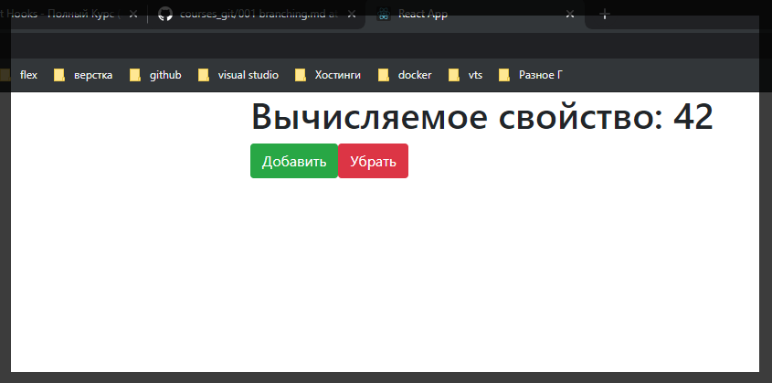
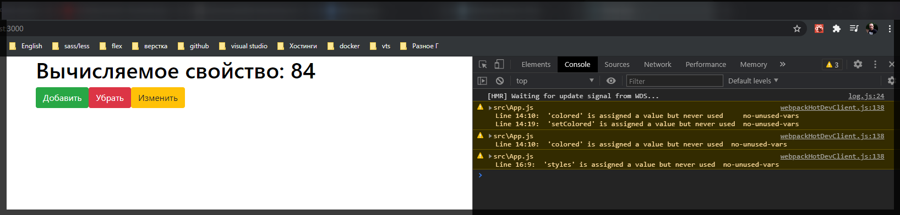
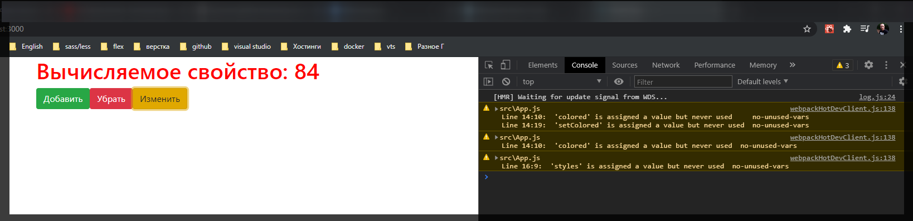
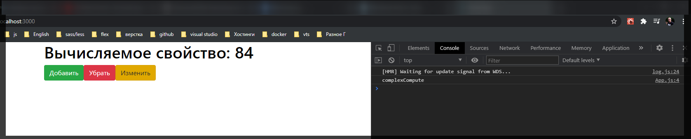
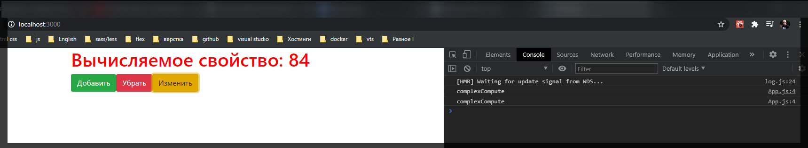
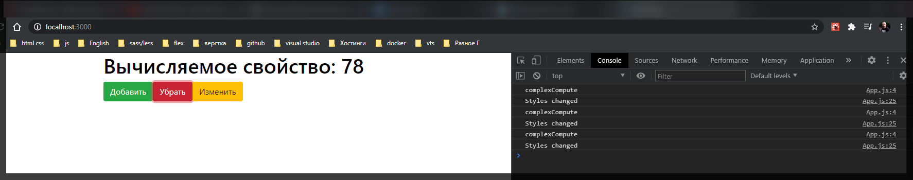

# useMemo

И так для рассмотрения следующего **hook** использую вот такой стартовый шаблон

```jsx
import React, { useState } from 'react';

function App() {
  const [number, setNumber] = useState(42);

  return (
    <>
      <h1>Вычисляемое свойство: {number}</h1>
      <button
        className={'btn btn-success'}
        onClick={() => setNumber((prev) => prev + 1)}
      >
        Добавить
      </button>
      <button
        className={'btn btn-danger'}
        onClick={() => setNumber((prev) => prev - 1)}
      >
        Убрать
      </button>
    </>
  );
}

export default App;
```



Сейчас мы будем говорить про следующий хук который позволяет оптимизировать приложение. Но для начало необходимо понять проблематику.

Для этого я напишу следующее. Предположим что на основе стартового состояния т.е. **number** ним необходимо вычислить новое значение с которым мы будем работать. Создам его как свойство **computed =** и мы его будем вычислять в очень сложной функции, которая будет работать очень долго, которую назову **complexComputed(number)** куда передаю number начальный **state**.

```js
import React, { useState } from 'react';

function App() {
  const [number, setNumber] = useState(42);

  const computed = complexCompute(number);

  return (
    <>
      <h1>Вычисляемое свойство: {number}</h1>
      <button
        className={'btn btn-success'}
        onClick={() => setNumber((prev) => prev + 1)}
      >
        Добавить
      </button>
      <button
        className={'btn btn-danger'}
        onClick={() => setNumber((prev) => prev - 1)}
      >
        Убрать
      </button>
    </>
  );
}

export default App;
```

И теперь нужно создать функцию **complexCompute**. И на самомделе в этой функции мы будем делать очень простую вещь **return num \* 2**. Но только чуть выше создам искуственную задержку с помощью цикла **while**.

```jsx
import React, { useState } from 'react';

function complexCompute(num) {
  let i = 0;
  while (i < 100000) {
    i++;
  }
  return num * 2;
}

function App() {
  const [number, setNumber] = useState(42);

  const computed = complexCompute(number);

  return (
    <>
      <h1>Вычисляемое свойство: {number}</h1>
      <button
        className={'btn btn-success'}
        onClick={() => setNumber((prev) => prev + 1)}
      >
        Добавить
      </button>
      <button
        className={'btn btn-danger'}
        onClick={() => setNumber((prev) => prev - 1)}
      >
        Убрать
      </button>
    </>
  );
}

export default App;
```

В чем вообще заключается идея такой функции? В том что это будет бессмысленный абсолютно цикл, который будет проводить столько пустых итераций, но фишка в том что он будет тормозить наше приложение.

Нам необходимо понять в какой момент мы можем оптимизировать приложение и избавиться от лишних вычислений. У нас есть свойство **computed** которое мы и будем выводить в наш заголовок **h1**

```jsx
import React, { useState } from 'react';

function complexCompute(num) {
  let i = 0;
  while (i < 100000) {
    i++;
  }
  return num * 2;
}

function App() {
  const [number, setNumber] = useState(42);

  const computed = complexCompute(number);

  return (
    <>
      <h1>Вычисляемое свойство: {computed}</h1>
      <button
        className={'btn btn-success'}
        onClick={() => setNumber((prev) => prev + 1)}
      >
        Добавить
      </button>
      <button
        className={'btn btn-danger'}
        onClick={() => setNumber((prev) => prev - 1)}
      >
        Убрать
      </button>
    </>
  );
}

export default App;
```

Не знаю код абсолютно такой же .... У него прилага тормозит у меня нет..... Хотя рендер страницы стал немного медленнее т.е. тут есть определенная задержка по той причине потому что процесс сам по себе довольно долгий.

Допустим для вычисляемого свойства мы ничего не можем сделать.

Но есть другая проблема. Допустим я заведу новый **state** который по умолчанию будет равняться **false** и называтся он будет **colored**. И так же создам еще один **button** которая при клике будет изменять состояние **colored** на предыдущее.

```jsx
import React, { useState } from 'react';

function complexCompute(num) {
  let i = 0;
  while (i < 100000000) i++;

  return num * 2;
}

function App() {
  const [number, setNumber] = useState(42);

  const computed = complexCompute(number);
  const [colored, setColored] = useState(false);

  return (
    <>
      <h1>Вычисляемое свойство: {computed}</h1>
      <button
        className={'btn btn-success'}
        onClick={() => setNumber((prev) => prev + 1)}
      >
        Добавить
      </button>
      <button
        className={'btn btn-danger'}
        onClick={() => setNumber((prev) => prev - 1)}
      >
        Убрать
      </button>
      <button
        className={'btn btn-warning'}
        onClick={() => setColored((prev) => !prev)}
      >
        Изменить
      </button>
    </>
  );
}

export default App;
```

Ну и что бы как-то визуально это изменить мы можем поменять стиль для заголовка **h1**. Создаю объект **styles** в котором прописываю условие что цвет зависит от состояния **colored** т.е. **color: colored ? 'darkred' : 'black'**. И далее как **reference** в атрибут **style** заголовка **h1** передаю данный объект.

```jsx
import React, { useState } from 'react';

function complexCompute(num) {
  let i = 0;
  while (i < 100000000) i++;

  return num * 2;
}

function App() {
  const [number, setNumber] = useState(42);

  const computed = complexCompute(number);
  const [colored, setColored] = useState(false);

  const styles = {
    color: colored ? 'darkred' : 'black',
  };

  return (
    <>
      <h1 style={styles}>Вычисляемое свойство: {computed}</h1>
      <button
        className={'btn btn-success'}
        onClick={() => setNumber((prev) => prev + 1)}
      >
        Добавить
      </button>
      <button
        className={'btn btn-danger'}
        onClick={() => setNumber((prev) => prev - 1)}
      >
        Убрать
      </button>
      <button
        className={'btn btn-warning'}
        onClick={() => setColored((prev) => !prev)}
      >
        Изменить
      </button>
    </>
  );
}

export default App;
```

Для более лучшей наглядности меняю цвет просто на красный.





В чем теперь проблема? Когда мы меняем цвет для заголовка все равно происходит определенная задержка. Потому что хоть мы и меняем состояние мы вызываем **render** всего компонента т.е. мы заново создаем эту функцию и получается что она заново заходит в функцию **complexCompute**. Я могу в этом убедится если в этой функции я выведу в консоль сообщение.

```jsx
import React, { useState } from 'react';

function complexCompute(num) {
  console.log('complexCompute');
  let i = 0;
  while (i < 100000000) i++;

  return num * 2;
}

function App() {
  const [number, setNumber] = useState(42);

  const computed = complexCompute(number);
  const [colored, setColored] = useState(false);

  const styles = {
    color: colored ? 'red' : 'black',
  };

  return (
    <>
      <h1 style={styles}>Вычисляемое свойство: {computed}</h1>
      <button
        className={'btn btn-success'}
        onClick={() => setNumber((prev) => prev + 1)}
      >
        Добавить
      </button>
      <button
        className={'btn btn-danger'}
        onClick={() => setNumber((prev) => prev - 1)}
      >
        Убрать
      </button>
      <button
        className={'btn btn-warning'}
        onClick={() => setColored((prev) => !prev)}
      >
        Изменить
      </button>
    </>
  );
}

export default App;
```

Логично когда эта функция вызывается когда я меняю состояние счетчика, но не логично когда эта функция вызывается при смене цвета.





И вот здесь мы можем как раз таки оптимизировать процесс. Для этого присутствует хук **useMemo**. И он используется следующим образом т.е. у меня есть значение **const computed = complexCompute(number);** которое я по сути могу закешировать т.е. если значение **number** не изменилось то по сути нет смысла заново вызывать эту функцию и поэтому мы просто берем и оборачиваем это вычисление **complexCompute(number);** в **useMemo**. Здесь идея такова что я передаю **callback** который должен вернуть вот это вычисление **complexCompute(number);** И вторым параметром я указываю от чего должно зависить это вычисление, т.е. вторым параметром передать набор зависимостей. В нашем случае мы зависим только от **number**. Поэтому мы говорим что вычисления у нас зависят от значания **number**.

```jsx
import React, { useState, useMemo } from 'react';

function complexCompute(num) {
  console.log('complexCompute');
  let i = 0;
  while (i < 100000000) i++;

  return num * 2;
}

function App() {
  const [number, setNumber] = useState(42);

  const [colored, setColored] = useState(false);

  const styles = {
    color: colored ? 'red' : 'black',
  };

  const computed = useMemo(() => {
    return complexCompute(number);
  }, [number]);

  return (
    <>
      <h1 style={styles}>Вычисляемое свойство: {computed}</h1>
      <button
        className={'btn btn-success'}
        onClick={() => setNumber((prev) => prev + 1)}
      >
        Добавить
      </button>
      <button
        className={'btn btn-danger'}
        onClick={() => setNumber((prev) => prev - 1)}
      >
        Убрать
      </button>
      <button
        className={'btn btn-warning'}
        onClick={() => setColored((prev) => !prev)}
      >
        Изменить
      </button>
    </>
  );
}

export default App;
```


Есть еще одно применение данного хука. Когда мы работаем например с объектами.

Здесь я могу привести следующий пример. Что если мы вызовем **useEffect** и допустим мы по какой-то причине хотим следить за объекто **styles**

```jsx
import React, { useState, useMemo, useEffect } from 'react';

function complexCompute(num) {
  console.log('complexCompute');
  let i = 0;
  while (i < 100000000) i++;

  return num * 2;
}

function App() {
  const [number, setNumber] = useState(42);

  const [colored, setColored] = useState(false);

  const styles = {
    color: colored ? 'red' : 'black',
  };

  const computed = useMemo(() => {
    return complexCompute(number);
  }, [number]);

  useEffect(() => {
    console.log('Styles changed');
  }, [styles]);

  return (
    <>
      <h1 style={styles}>Вычисляемое свойство: {computed}</h1>
      <button
        className={'btn btn-success'}
        onClick={() => setNumber((prev) => prev + 1)}
      >
        Добавить
      </button>
      <button
        className={'btn btn-danger'}
        onClick={() => setNumber((prev) => prev - 1)}
      >
        Убрать
      </button>
      <button
        className={'btn btn-warning'}
        onClick={() => setColored((prev) => !prev)}
      >
        Изменить
      </button>
    </>
  );
}

export default App;
```

Смотрите когда мы меняем счетчик в какой-то момент у нас меняются и стили.



Получается сейчас идет лишний вызов **useEffect** по какой-то причине. И если бы вот здесь

```jsx
useEffect(() => {
  console.log('Styles changed');
}, [styles]);
```

былибы какие-то асинхронные запросы т.е. к серверу или какие-то сложные вычисления то это удар по производительности.

Соответственно почему вообще это происходит? Дело в том что в **JS** объекты храняться по ссылочной системе т.е. например если я создам такой-же объект

```jsx
const styles = {
  color: colored ? 'red' : 'black',
};
```

с точно таким же значением, он не будет равен этому объекту т.е. вот пример.

```jsx
const styles = {
  color: colored ? 'red' : 'black',
};

const styles2 = {
  color: colored ? 'red' : 'black',
};

console.log(styles === styles2); // false
```

Мы получаем **false** потому что объекты сравниваются по ссылке а не посодержимому. т.е. значение у них может быть одинаковое.

Когда у нас происходит изменение **state**. Как в моем случае я меняю **counter**. Вызывается **render** и создается новый объект

```jsx
const styles = {
  color: colored ? 'red' : 'black',
};
```

А useEffect

```jsx
useEffect(() => {
  console.log('Styles changed');
}, [styles]);
```

смотрит за старым объектом, он видит что он изменился и по этому вызывает данный **callback**.

Здесь как раз токи на помощь тоже может прийти useMemo который возьмет и сохранит этот объект на следующий **render**

```jsx
const styles = {
  color: colored ? 'red' : 'black',
};
```

т.е. выглядит это следующим образом.

```jsx
import React, { useState, useMemo, useEffect } from 'react';

function complexCompute(num) {
  console.log('complexCompute');
  let i = 0;
  while (i < 100000000) i++;

  return num * 2;
}

function App() {
  const [number, setNumber] = useState(42);

  const [colored, setColored] = useState(false);

  const styles = useMemo(() => {
    return {
      color: colored ? 'red' : 'black',
    };
  });

  const computed = useMemo(() => {
    return complexCompute(number);
  }, [number]);

  useEffect(() => {
    console.log('Styles changed');
  }, [styles]);

  return (
    <>
      <h1 style={styles}>Вычисляемое свойство: {computed}</h1>
      <button
        className={'btn btn-success'}
        onClick={() => setNumber((prev) => prev + 1)}
      >
        Добавить
      </button>
      <button
        className={'btn btn-danger'}
        onClick={() => setNumber((prev) => prev - 1)}
      >
        Убрать
      </button>
      <button
        className={'btn btn-warning'}
        onClick={() => setColored((prev) => !prev)}
      >
        Изменить
      </button>
    </>
  );
}

export default App;
```

Если мы хотим сократить то можно все обозначить в круглые скобки и вернуть объект

```jsx
const styles = useMemo(() => ({
  color: colored ? 'red' : 'black',
}));
```

И дальше вторым параметром в **dependencies** указываю то от чего мы зависим **colored**.

```jsx
const styles = useMemo(
  () => ({
    color: colored ? 'red' : 'black',
  }),
  [colored]
);
```

```jsx
import React, { useState, useMemo, useEffect } from 'react';

function complexCompute(num) {
  console.log('complexCompute');
  let i = 0;
  while (i < 100000000) i++;

  return num * 2;
}

function App() {
  const [number, setNumber] = useState(42);

  const [colored, setColored] = useState(false);

  const styles = useMemo(
    () => ({
      color: colored ? 'red' : 'black',
    }),
    [colored]
  );

  const computed = useMemo(() => {
    return complexCompute(number);
  }, [number]);

  useEffect(() => {
    console.log('Styles changed');
  }, [styles]);

  return (
    <>
      <h1 style={styles}>Вычисляемое свойство: {computed}</h1>
      <button
        className={'btn btn-success'}
        onClick={() => setNumber((prev) => prev + 1)}
      >
        Добавить
      </button>
      <button
        className={'btn btn-danger'}
        onClick={() => setNumber((prev) => prev - 1)}
      >
        Убрать
      </button>
      <button
        className={'btn btn-warning'}
        onClick={() => setColored((prev) => !prev)}
      >
        Изменить
      </button>
    </>
  );
}

export default App;
```


При изменении счетчика **useEffect** не вызывается потому что мы его закешировали.

> Т.е. учитывайте это при работе с объектами потому что это. **useMemo** нам может помочь. Но стоит ли постоянно все кэшировать в **useMemo**? Нет!! Во-первых потому что это тоже некоторый код. Занимает память, потому что он кэширует определенные значения. Это все таки функция которая вызывается. По-этому с ним тоже нужно быть аккуратным. Вызывать **useMemo** нужно вызывать только в том случае когда это реально может ударить по производительности.
