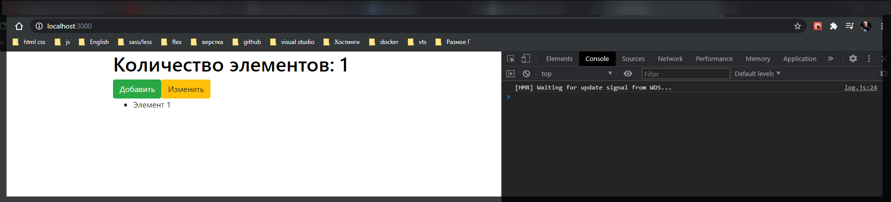
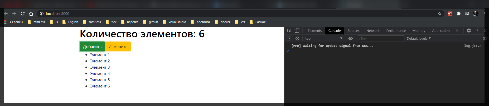
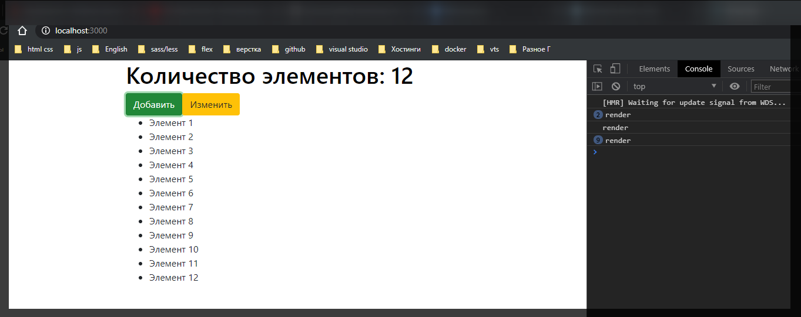
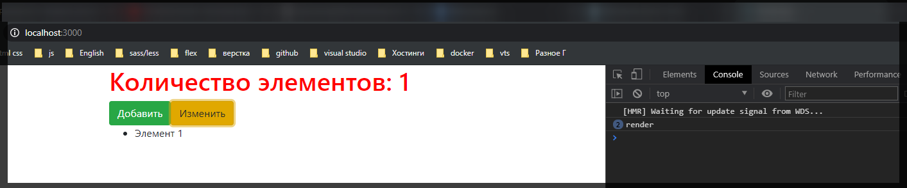
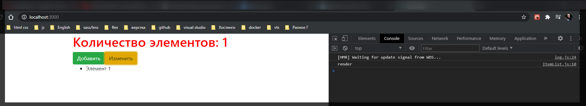

# useCallback

Сейчас поговорим про один из самых не обычных но самых полезных и важных хуков которые есть в **React**. И для этого опять использую подготовленный шаблон.

```jsx
import React, { useState } from 'react';

function App() {
  const [colored, setColored] = useState(false);
  const [count, setCount] = useState(1);

  const styles = {
    color: colored ? 'red' : 'black',
  };

  return (
    <>
      <h1 style={styles}>Количество элементов: {count}</h1>
      <button
        className={'btn btn-success'}
        onClick={() => setCount((prev) => prev + 1)}
      >
        Добавить
      </button>
      <button
        className={'btn btn-warning'}
        onClick={() => setColored((prev) => !prev)}
      >
        Изменить
      </button>
    </>
  );
}

export default App;
```

В данном примере есть два **state**. Состояние счетчика и состояние цвета. Увеличивать счетчик мы можем только в одну сторону. И менять цвет заголовка.

Теперь допишем некоторую логику для того что бы вы поняли в чем вообще является идея **useCallback**.

Предположим что у нас есть некоторая функция которая позволяет нам на основе **state** **count** генерировать количество элементов которые мы в последствии хотим вывести в компонент. Т.е. я это могу создать как стрелочную функцию и назову ее **generateItemsFromAPI**. Безусловно мы не будем обращаться к **API**, но фишка в том что мы как бы съэмулируем этот процесс. Потому что мы зачастую забираем данные не локально, а мы идем по **API**.

```jsx
import React, { useState } from 'react';

function App() {
  const [colored, setColored] = useState(false);
  const [count, setCount] = useState(1);

  const styles = {
    color: colored ? 'red' : 'black',
  };

  const generateItemsFromAPI = () => {};

  return (
    <>
      <h1 style={styles}>Количество элементов: {count}</h1>
      <button
        className={'btn btn-success'}
        onClick={() => setCount((prev) => prev + 1)}
      >
        Добавить
      </button>
      <button
        className={'btn btn-warning'}
        onClick={() => setColored((prev) => !prev)}
      >
        Изменить
      </button>
    </>
  );
}

export default App;
```

Здесь же на самом деле что мы будем делать? Мы просто на основе значения **count** сгенерируем нужное нам количество элементов. В этой функции я создаю новый **new Array()**. Какой длинны у нас должен быть массив? А длинны он будет длинны нашего состояния **count**. Дальше для того что бы все эти элеметы проинициализировались с помощью метода **fill()** мы их заполняем чем-то, допустим пустыми строчками и дальше с помощью **map()** мы трансформируем весь этот массив в новый массив. В первый параметр callback ,который вызываю в map, ставлю placeholder т.е. **\_,** т.к. сам элемент меня не интересует, а вторым параметром указываю **i** и после чего вывожу его **i + 1** для того что бы все начиналось с еденицы.

```jsx
import React, { useState } from 'react';

function App() {
  const [colored, setColored] = useState(false);
  const [count, setCount] = useState(1);

  const styles = {
    color: colored ? 'red' : 'black',
  };

  const generateItemsFromAPI = () => {
    return new Array(count).fill('').map((_, i) => `Элемент ${i + 1}`);
  };

  return (
    <>
      <h1 style={styles}>Количество элементов: {count}</h1>
      <button
        className={'btn btn-success'}
        onClick={() => setCount((prev) => prev + 1)}
      >
        Добавить
      </button>
      <button
        className={'btn btn-warning'}
        onClick={() => setColored((prev) => !prev)}
      >
        Изменить
      </button>
    </>
  );
}

export default App;
```

Вот такая вот интересная логика. И получается что функция **generateItemsFromAPI** работает в зависимости от **count**.

Теперь допустим я хочу передать данную функцию как **reference** для другого компонента где мы будем его использовать. Допустим я назову элемент как **ItemList.js**

```jsx
// ItemList.js
import React from 'react';

export default function ItemsList() {}
```

Данная функция будет принимать в себя параметр к примеру **getItems**, название сам придумал, который помещаю в фигурные скобки.

В теле функции буду возвращать допустим список где мы будем получать список этих элементов и выводить их в шаблон.

```jsx
// ItemList.js
import React from 'react';

export default function ItemsList({ getItems }) {
  return <ul>{}</ul>;
}
```

Для того что бы их получить я создаю локальный **state** и назову его **items**. Само состояние будет по умолчанию пустым массивом.

```jsx
// ItemList.js
import React, { useState } from 'react';

export default function ItemsList({ getItems }) {
  const [items, setItems] = useState([]);
  return <ul>{}</ul>;
}
```

Но как только у нас будет изменяться **getItems** мы соответственно будем заполнять наш массив. Это мы можем проследить с помощью **useEffect** где как зависимость мы принимаем входящий **prop** **getItems**. И в теле **callback useEffect** создаю **const new Items = вызывая getItems()**. И далее в метод **setItems(newItems)**.

```jsx
// ItemList.js
import React, { useEffect, useState } from 'react';

export default function ItemsList({ getItems }) {
  const [items, setItems] = useState([]);

  useEffect(() => {
    const newItems = getItems();
    setItems(newItems);
  }, [getItems]);

  return <ul>{}</ul>;
}
```

И далее с помощью простой итерации вывожу

```jsx
// ItemList.js
import React, { useEffect, useState } from 'react';

export default function ItemsList({ getItems }) {
  const [items, setItems] = useState([]);

  useEffect(() => {
    const newItems = getItems();
    setItems(newItems);
  }, [getItems]);

  return (
    <ul>
      {items.map((i) => (
        <li key={i}>{i}</li>
      ))}
    </ul>
  );
}
```

И теперь в **App.js** Импортирую и вывожу данный компонент в которой как **props** передаю **getItems={}**, но в нашем случае функция называется **generateItemsFromAPI**.

```jsx
//App.js
import React, { useState } from 'react';
import ItemsList from './ItemList';

function App() {
  const [colored, setColored] = useState(false);
  const [count, setCount] = useState(1);

  const styles = {
    color: colored ? 'red' : 'black',
  };

  const generateItemsFromAPI = () => {
    return new Array(count).fill('').map((_, i) => `Элемент ${i + 1}`);
  };

  return (
    <>
      <h1 style={styles}>Количество элементов: {count}</h1>
      <button
        className={'btn btn-success'}
        onClick={() => setCount((prev) => prev + 1)}
      >
        Добавить
      </button>
      <button
        className={'btn btn-warning'}
        onClick={() => setColored((prev) => !prev)}
      >
        Изменить
      </button>
      <ItemsList getItems={generateItemsFromAPI} />
    </>
  );
}

export default App;
```

И теперь давайте посмотрим как это работает. И работает это довольно таки не плохо. По той причине что у нас есть один элемент.



Нажимаю добавить и соответственно добавляются элементы.



Логика железная. Все работает прекрасно и нет ни каких проблем. На самом деле проблемы есть и связаны они с оптимазацией.

Что если мы возьмем и проследим сколько раз вызывается **useEffect**

```jsx
// ItemList.js
import React, { useEffect, useState } from 'react';

export default function ItemsList({ getItems }) {
  const [items, setItems] = useState([]);

  useEffect(() => {
    const newItems = getItems();
    setItems(newItems);
    console.log('render');
  }, [getItems]);

  return (
    <ul>
      {items.map((i) => (
        <li key={i}>{i}</li>
      ))}
    </ul>
  );
}
```



Проблемы начинаются тогда когда мы например хотим изменить другой **state** в компоненте. Меняем цвет заголовка. Количество элементов не меняется а вот **render** вызывается.



Теперь допустим что здесь не какая то статическая генерация элементов

```jsx
const generateItemsFromAPI = () => {
  return new Array(count).fill('').map((_, i) => `Элемент ${i + 1}`);
};
```

```jsx
//App.js
import React, { useState } from 'react';
import ItemsList from './ItemList';

function App() {
  const [colored, setColored] = useState(false);
  const [count, setCount] = useState(1);

  const styles = {
    color: colored ? 'red' : 'black',
  };

  const generateItemsFromAPI = () => {
    return new Array(count).fill('').map((_, i) => `Элемент ${i + 1}`);
  };

  return (
    <>
      <h1 style={styles}>Количество элементов: {count}</h1>
      <button
        className={'btn btn-success'}
        onClick={() => setCount((prev) => prev + 1)}
      >
        Добавить
      </button>
      <button
        className={'btn btn-warning'}
        onClick={() => setColored((prev) => !prev)}
      >
        Изменить
      </button>
      <ItemsList getItems={generateItemsFromAPI} />
    </>
  );
}

export default App;
```

А допустим мы производим запрос к серверу. Получается что мы вызываем эту функцию много лишних раз. Это серьузный удар по нашей производительности.

Почему так происходит? Если мы вспомним прошлый пример с **useMemo**, то когда мы говорили про объекты, здесь та же самая проблема. Потому что функция как бы при новом рендере она создается, а новый рендер происходит потому что мы меняем состояние **colored**. Т.е. мы не затрагиваем **count** он не изменился.

По сути для решения данной проблемы и используется **useCallback** который делает по сути тоже самое что и **useMemo** т.е. он берет и оборачивает какой-то **callback**. И так же вторым параметром указываю зависимость, в нашем случае **count**

```jsx
//App.js
import React, { useState, useCallback } from 'react';
import ItemsList from './ItemList';

function App() {
  const [colored, setColored] = useState(false);
  const [count, setCount] = useState(1);

  const styles = {
    color: colored ? 'red' : 'black',
  };

  const generateItemsFromAPI = useCallback(() => {
    return new Array(count).fill('').map((_, i) => `Элемент ${i + 1}`);
  }, [count]);

  return (
    <>
      <h1 style={styles}>Количество элементов: {count}</h1>
      <button
        className={'btn btn-success'}
        onClick={() => setCount((prev) => prev + 1)}
      >
        Добавить
      </button>
      <button
        className={'btn btn-warning'}
        onClick={() => setColored((prev) => !prev)}
      >
        Изменить
      </button>
      <ItemsList getItems={generateItemsFromAPI} />
    </>
  );
}

export default App;
```



Данная проблема решена.

Если проводить аналогию с **useMemo** то **useCallback** так же оборачивает **callback**, но он и его полность возвращает т.е. вот эта вот **generateItemsFromAPI** переменная это не результат того что происходит в функции а это сама функция. Т.к. как результатом я получаю сам **callback**.

**useCallback** нужен для того что бы функция не изменялась при новом рендере, она как бы кэшировалась и соответственно у нас не было ни каких рекурсивных вызовов, но и дополнительных сторонних проблем.
