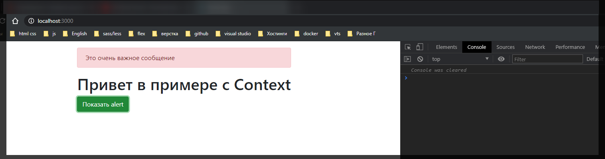

# useContext

Теперь напишем приложение с ноля. На основе этого приложения мы разберем другой **hook**.

Самое время что же такое контекст.

```jsx
//App.js
import React from 'react';
import Main from './Main';

function App() {
  return (
    <div className={'container'}>
      <Main />
    </div>
  );
}

export default App;
```

И дальше создам комопнент **Main.js**

```jsx
import React from 'react';

export default function Main() {
  return (
    <>
      <h1>Привет в примере с Context</h1>
      <button className="btn btn-success">Показать alert </button>
    </>
  );
}
```

Пока что мы не будем его оживлять


И теперь поработаем над компонентом **Alert.js** который так же создаю в корне.

```jsx
import React from 'react';

export default function Alert() {
  return <div className={'alert alert-danger'}>Это очень важное сообщение</div>;
}
```

```jsx
//App.js
import React from 'react';
import Main from './Main';
import Alert from './Alert';

function App() {
  return (
    <div className={'container'}>
      <Alert />
      <Main />
    </div>
  );
}

export default App;
```


Как вы уже поняли мы будем с помощью контекста взаимодействовать с нашим **alert**. Потому что постоянно его показывать как-то не очень. Обычно такие сообщения показываются когда происходит какое-то действие от пользователя.

Фишка в том что кнопка находится в компоненте **Main** и нам нужно связать данную кнопку с поведением компонента **Alert**.

Т.е. безусловно мы можем пойти по стандартному пути, передавая **props** от **Main** в **Alert** через **App**. Все это конечно очень не красиво, очень не надежно и поэтому **React** давно ввели концепцию контекстов. Поэтому давайте посмотрим как мы это можем сделать с помощью контекстов.

В **App.js** создаю **AlertContext** с помощью **React**. и вызываю функцию **createContext()**. И далее я говорю что все наше приложение я хочу обернуть в **AlertContext**

```jsx
//App.js
import React from 'react';
import Main from './Main';
import Alert from './Alert';

const AlertContext = React.createContext();

function App() {
  return (
    <AlertContext>
      <div className={'container pt-3'}>
        <Alert />
        <Main />
      </div>
    </AlertContext>
  );
}

export default App;
```

Но сама обертка должна быть **Provider** а не просто данный компонент **AlertContext**. У нас есть два компонента **Provider** и **Consumer** и мы конечно воспользуемся **Provider**.

```jsx
//App.js
import React from 'react';
import Main from './Main';
import Alert from './Alert';

const AlertContext = React.createContext();

function App() {
  return (
    <AlertContext.Provider>
      <div className={'container pt-3'}>
        <Alert />
        <Main />
      </div>
    </AlertContext.Provider>
  );
}

export default App;
```

Provider потому что здесь мы предоставляем какое-либо состояние.

К вопросу о состояниях. Нам его нужно так же добавить. Добавляю через **useState**. Пока что это будет просто **false**.

```jsx
//App.js
import React, { useState } from 'react';
import Main from './Main';
import Alert from './Alert';

const AlertContext = React.createContext();

function App() {
  const [alert, setAlert] = useState(false);

  return (
    <AlertContext.Provider>
      <div className={'container pt-3'}>
        <Alert />
        <Main />
      </div>
    </AlertContext.Provider>
  );
}

export default App;
```

Теперь нам необходимо в **Provider** передать это состояние с помощью свойства **value** куда мы сразу передаем объект **value={{}}**, или же мы просто передаем **alert**.

```jsx
//App.js
import React, { useState } from 'react';
import Main from './Main';
import Alert from './Alert';

const AlertContext = React.createContext();

function App() {
  const [alert, setAlert] = useState(false);

  return (
    <AlertContext.Provider value={alert}>
      <div className={'container pt-3'}>
        <Alert />
        <Main />
      </div>
    </AlertContext.Provider>
  );
}

export default App;
```

Теперь во всех присутствующих компонентах я могу обратится к состоянию **alert**.

Безусловно нам это нужно сделать в самом компонента **Alert.js**

Обращение к контексту в классовых компонентах надеюсь вы помните. Там вот это вот


необходимо обернуть в **AlertContext.Consumer** и соответственно мы получаем соответствующее значение.

Но в функциональных компонентах теперь это сделать еще проще потому что мы можем воспользоватся хуком **useContext**.

```jsx
import React, { useContext } from 'react';

export default function Alert() {
  return <div className={'alert alert-danger'}>Это очень важное сообщение</div>;
}
```

Теперь для того что бы получить состояния этого alert мы вызываем хук **useContext()** и в него мы должны передать тот контекст которого мы хотим получить состояние. Для этого мы должны его экспортировать из **App.js**

```jsx
//App.js
import React, { useState } from 'react';
import Main from './Main';
import Alert from './Alert';

export const AlertContext = React.createContext();

function App() {
  const [alert, setAlert] = useState(false);

  return (
    <AlertContext.Provider value={alert}>
      <div className={'container pt-3'}>
        <Alert />
        <Main />
      </div>
    </AlertContext.Provider>
  );
}

export default App;
```

```jsx
import React, { useContext } from 'react';
import { AlertContext } from './App';

export default function Alert() {
  const alert = useContext(AlertContext);
  return <div className={'alert alert-danger'}>Это очень важное сообщение</div>;
}
```

Ну и дальше я могу прописать условие что если не **alert** тогда мы просто возвращаем **null** и ничего не ренедерим


теперь получается что все это так же нужно связать с кнопочкой **button**.

Пробую это все упростить и в **Main** просто передать функцию позволяющую менять видимосто **alert**. И создаю данную функцию в **App.js**. Называю ее **toggleAlert = () =>{}** будет происходит обращаение к **setAlert** и изменять предыдущее состояние на предыдущее. И далее в компонет **Main** в атрибут **toggle** передаю **reference** **toggleAlert**.

```jsx
//App.js
import React, { useState } from 'react';
import Main from './Main';
import Alert from './Alert';

export const AlertContext = React.createContext();

function App() {
  const [alert, setAlert] = useState(false);

  const toggleAlert = () => setAlert((prev) => !prev);

  return (
    <AlertContext.Provider value={alert}>
      <div className={'container pt-3'}>
        <Alert />
        <Main toggle={toggleAlert} />
      </div>
    </AlertContext.Provider>
  );
}

export default App;
```

Т.е. безусловно мы эту функцию


Но чуть позже рассмотрим как это сделать элегантнее. Пока что мы просто разбираемся с базой.

Далее в компонете в функции Main принимаю **toggle** и добавляю событие клика вызываю функцию **onClick={toggle}**.

```jsx
import React from 'react';

export default function Main({ toggle }) {
  return (
    <>
      <h1>Привет в примере с Context</h1>
      <button onClick={toggle} className="btn btn-success">
        Показать alert{' '}
      </button>
    </>
  );
}
```


Теперь у нас появляется динамика. Мы Успешно связали компонент **Main** с компонентом **Alert** через контекст.

Здесь конечно присутствует некоторое количество проблем в том плане что наш компонент **App** довольно не красивый. По той причине что здесь добавляется какой-то **state**, различные **Provider**. Логика которая относится к **Alert** она описана прямо здесь в **App.js**. На самом деле мы можем это все оптимизировать и упростить. Это напрямую не относится к хукам, но тем не менее про это важно знать и понимать как это сделать.

По сути то что я сейчас покажу полностью дублирует функционал **Angular** сервисов. На мой взгляд это очень круто.

Создаю например файл **AlertContext.js**

Здесь мы будем полностью описывать весь функционал который относится к **alert**.

Дале круче. Создаю папку **alert** и передаю туда все что относится к **alert**.


```jsx
//alert/AlertContext.js
import React from 'react';

const AlertContext = React.createContext();
```

И дальше мы создадим внутренний компонент который я назову, и сразу буду его export, **AlertProvider = () =>{}** это будет функциональный компонент который будет возвращать <AlertContext.Provider value={}>

```jsx
//alert/AlertContext.js
import React from 'react';

const AlertContext = React.createContext();

export const AlertProvider = () => {
  return <AlertContext.Provider value={}></AlertContext.Provider>;
};
```

Т.е. это у нас будет корневой **jsx** элемент. И дальше что бы мы могли оборачивать в этот **Provider** любой **jsx** в параметры функции **AlertProvider** передаю параметр **{children}**

```jsx
//alert/AlertContext.js
import React from 'react';

const AlertContext = React.createContext();

export const AlertProvider = ({ children }) => {
  return <AlertContext.Provider value={}>{children}</AlertContext.Provider>;
};
```

Теперь прелесть заключается в том что у нас есть компонент **AlertProvider** который не несет в себе ни какого шаблона. Птому что все эти вещи не превращаются в обычные **html** теги. Но при этом у нас теперь есть место где мы можем описывать изолированную логику относительно нашего **Alert**. Мы здесь можем пользоваться так же хуками

```jsx
//alert/AlertContext.js
import React from 'react';

const AlertContext = React.createContext();

export const AlertProvider = ({ children }) => {
  const [alert, setAlert] = useState(false);

  const toggle = () => setAlert((prev) => !prev);

  return (
    <AlertContext.Provider value={alert}>{children}</AlertContext.Provider>
  );
};
```

И теперь отрефакторим **App.js**

```jsx
//App.js
import React from 'react';
import Main from './Main';
import Alert from './alert/Alert';
import AlertProvider from './alert/AlertContext';

function App() {
  return (
    <AlertProvider>
      <div className={'container pt-3'}>
        <Alert />
        <Main toggle={toggleAlert} />
      </div>
    </AlertProvider>
  );
}

export default App;
```

теперь все наше приложение обернуто в **Provider** т.е. в некоторый сервис который обозначает область вилдимости этого **Provider**. и теперь все находится внутри оно имеет доступ к занчениям этого **AlertProvider**.

Пока остается небольшая проблема с **Main** потому что мы сюда передаем **toggleAlert** а он ничего не далает Пока временно передаю пустую функцию.

Пока что у нас отсутствует **AlertContext**. И для этого его так же времменно **export**.

```jsx
//alert/AlertContext.js
import React, { useState } from 'react';

export const AlertContext = React.createContext();

export const AlertProvider = ({ children }) => {
  const [alert, setAlert] = useState(false);

  const toggle = () => setAlert((prev) => !prev);

  return (
    <AlertContext.Provider value={alert}>{children}</AlertContext.Provider>
  );
};
```

Т.е. должно получится так

```jsx
//App.js
import React from 'react';
import Main from './Main';
import Alert from './alert/Alert';
import { AlertProvider } from './alert/AlertContext';

function App() {
  return (
    <AlertProvider>
      <div className={'container pt-3'}>
        <Alert />
        <Main toggle={() => {}} />
      </div>
    </AlertProvider>
  );
}

export default App;
```

```jsx
//alert/AlertContext.js
import React, { useState } from 'react';

export const AlertContext = React.createContext();

export const AlertProvider = ({ children }) => {
  const [alert, setAlert] = useState(false);

  const toggle = () => setAlert((prev) => !prev);

  return (
    <AlertContext.Provider value={alert}>{children}</AlertContext.Provider>
  );
};
```

```jsx
import React, { useContext } from 'react';
import { AlertContext } from './AlertContext';

export default function Alert() {
  const alert = useContext(AlertContext);

  if (!alert) return null;

  return <div className={'alert alert-danger'}>Это очень важное сообщение</div>;
}
```


У нас нет ошибок, но теперь при этом у нас другое формирование кода.

Как теперь нам поменять наше приложение на то что бы оно работало?

Во-первых сразу же хочу обратить внимание вот на эту строчку.


Здесь мы импортируем какой-то контекст, юзаем его с помощью **useContext()**.

И мы можем это дело сделать более красивым таким образом. Мы не будем **export** контекст. Мы будем экспортировать функцию которую допустим я назову **useAlert** по аналогии с хуками, это будет **callback** который будет просто возвращать результат работы функции **useContext(AlertContext)** но он будет обращаться к приватной для этого модуля переменной **AlertContext**

```jsx
//alert/AlertContext.js
import React, { useContext, useState } from 'react';

const AlertContext = React.createContext();

export const useAlert = () => {
  return useContext(AlertContext);
};

export const AlertProvider = ({ children }) => {
  const [alert, setAlert] = useState(false);

  const toggle = () => setAlert((prev) => !prev);

  return (
    <AlertContext.Provider value={alert}>{children}</AlertContext.Provider>
  );
};
```

И теперь допустим в компоненте **Alert.ls** вместо того что бы использовать


Или использовать хук useContext. Мы просто вызываем **useAlert()**. Ну и соответственно удаляю все лишнее.

```jsx
import React from 'react';
import { useAlert } from './AlertContext';

export default function Alert() {
  const alert = useAlert();

  if (!alert) return null;

  return <div className={'alert alert-danger'}>Это очень важное сообщение</div>;
}
```

Однако это все еще не решает ту проблему что еще не вида функция **toggle**.


На самом деле есть два варианта решения проблемы. Мы можем создать еще один контекст **AlertToggleContext**

```jsx
//alert/AlertContext.js
import React, { useContext, useState } from 'react';

const AlertContext = React.createContext();
const AlertToggleContext = React.createContext();

export const useAlert = () => {
  return useContext(AlertContext);
};

export const AlertProvider = ({ children }) => {
  const [alert, setAlert] = useState(false);

  const toggle = () => setAlert((prev) => !prev);

  return (
    <AlertContext.Provider value={alert}>{children}</AlertContext.Provider>
  );
};
```

Далее создать еще одну функцию например **useAlertToggle**

```jsx
//alert/AlertContext.js
import React, { useContext, useState } from 'react';

const AlertContext = React.createContext();
const AlertToggleContext = React.createContext();

export const useAlert = () => {
  return useContext(AlertContext);
};

export const useAlertToggle = () => {
  return useContext(AlertToggleContext);
};

export const AlertProvider = ({ children }) => {
  const [alert, setAlert] = useState(false);

  const toggle = () => setAlert((prev) => !prev);

  return (
    <AlertContext.Provider value={alert}>{children}</AlertContext.Provider>
  );
};
```

И теперь для того что бы экспортировать функцию **toggle** Мы так же обращаемся к новому контексту <AlertToggleContext> Далее говорим что это <AlertToggleContext.Provider value={toggle}>

```jsx
//alert/AlertContext.js
import React, { useContext, useState } from 'react';

const AlertContext = React.createContext();
const AlertToggleContext = React.createContext();

export const useAlert = () => {
  return useContext(AlertContext);
};

export const useAlertToggle = () => {
  return useContext(AlertToggleContext);
};

export const AlertProvider = ({ children }) => {
  const [alert, setAlert] = useState(false);

  const toggle = () => setAlert((prev) => !prev);

  return (
    <AlertContext.Provider value={alert}>
      <AlertToggleContext.Provider value={toggle}>
        {children}
      </AlertToggleContext.Provider>
    </AlertContext.Provider>
  );
};
```

Теперь получается что у нас есть два **Provider** только теперь у нас дополнительно экспортируется функция **toggle**.

И теперь в **Main** я могу воспользоваться функцией **useAlertToggle**

```jsx
import React from 'react';
import { useAlertToggle } from './alert/AlertContext';

export default function Main() {
  const toggle = useAlertToggle();
  return (
    <>
      <h1>Привет в примере с Context</h1>
      <button onClick={toggle} className="btn btn-success">
        Показать alert{' '}
      </button>
    </>
  );
}
```



Но порой когда много экспортируемых элементов получается такой подход не очень корректен. Поэтому естественно существует другой путь.

Когда мы экспортируем в Provider не какое-то значение, а объект, где например мы обозначаем какие-то другие поля к примеру **visible: alert** где у нас например отображение **alert** отвечает **state** **alert**, ну и собственно мы экспортируем здесь функцию **toggle**


только в этом случае необходимо поправить все использование.

Во-первых у нас теперь есть только функцию **useAlert** и в **Main.js** я должен ей воспользоватся **import { useAlert } from './alert/AlertContext';**

```jsx
//Main.js
import React from 'react';
import { useAlert } from './alert/AlertContext';

export default function Main() {
  const { toggle } = useAlert();
  return (
    <>
      <h1>Привет в примере с Context</h1>
      <button onClick={toggle} className="btn btn-success">
        Показать alert{' '}
      </button>
    </>
  );
}
```

Так как здесь я получаю объект я сразу забираю необходимое поле **const {toggle} = useAlert();**

А у самого **alert** теперь есть поле **visible** на которое мыреагируем

```jsx
import React from 'react';
import { useAlert } from './AlertContext';

export default function Alert() {
  const alert = useAlert();

  if (!alert.visible) return null;

  return <div className={'alert alert-danger'}>Это очень важное сообщение</div>;
}
```

Прелесть в том что теперь в самом **alert** мы можем использовать необходимые функции Скажем при клике на этот **alert** мы вызываем сам **alert.toggle**

```jsx
import React from 'react';
import { useAlert } from './AlertContext';

export default function Alert() {
  const alert = useAlert();

  if (!alert.visible) return null;

  return (
    <div className={'alert alert-danger'} onClick={alert.toggle}>
      Это очень важное сообщение
    </div>
  );
}
```

Теперь когда кликаю на кнопку **alert** появляется, когда кликаю на сам **alert** сообщение исчезает.
