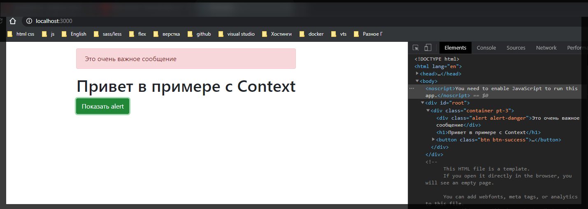
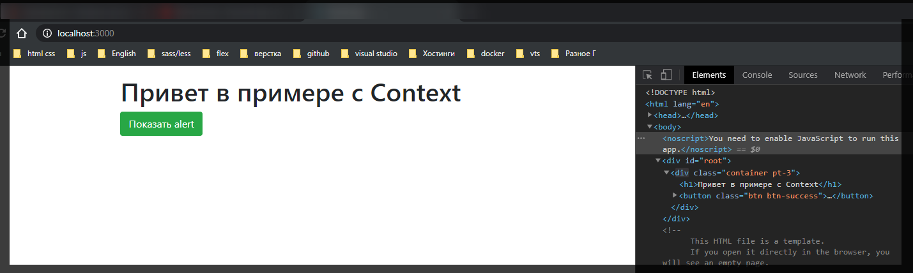
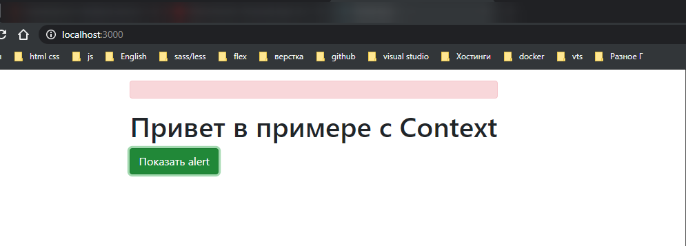
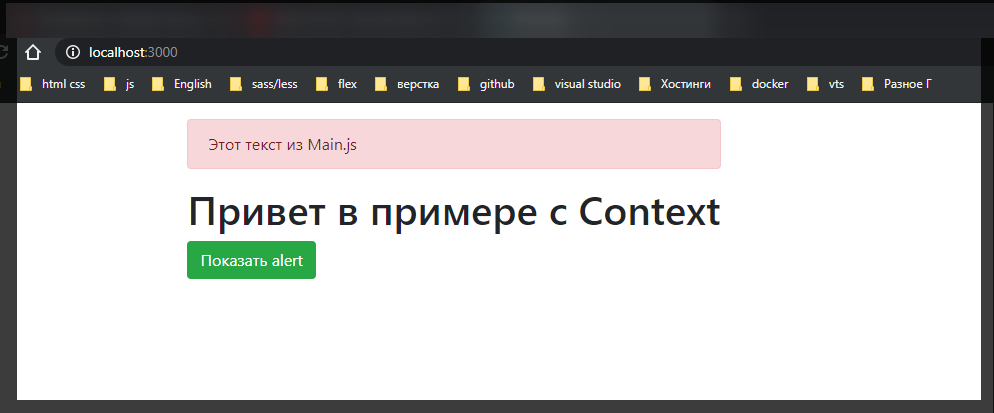

# useReduser

И давайте сразу же мы будем с ним взаимодействовать в файле **alert** контекст.

Для этого я его импортирую

```jsx
//alert/AlertContext.js
import React, { useContext, useState, useReducer } from 'react';

const AlertContext = React.createContext();
// const AlertToggleContext = React.createContext();

export const useAlert = () => {
  return useContext(AlertContext);
};

// export const useAlertToggle = () => {
//   return useContext(AlertToggleContext);
// };

export const AlertProvider = ({ children }) => {
  const [alert, setAlert] = useState(false);

  const toggle = () => setAlert((prev) => !prev);

  return (
    <AlertContext.Provider
      value={{
        visible: alert,
        toggle,
      }}
    >
      {children}
    </AlertContext.Provider>
  );
};
```

Если вы работали с **redux**, то понять принцип работы **useReduser** вам будет достаточно просто. По-сути его идея заключается в том же в чем и идея **useState**. т.е. **useReducer** нам позволяет работать со **state** только через **useReducer**. Когда мы с помощью сторонней функции изменяем состояние и соответственно это состояние меняется в компоненте.

Перепишем логику **alert** на использование **useReducer**.

Данный хук первым параметром принимает в себя непосредственно сам **reducer**, т.е. это функция которую нам необходимо создать.

Правила **reduser** таковы что эта функция **pure function(чистая функция)** т.е. она не имеет ни каких сайт эффектов. Она принимает в себя первым параметром **state** и вторым параметром принимает **action**. Что важно внутри тела функции мы делаем **switch** **case** по **action.type**. Но мы всегда по **default** если не один **case** не сработал возвращаем непосредственно сам **return state**. Вот абсолютно базовый **reducer** для любого приложения.

```jsx
//alert/AlertContext.js
import React, { useContext, useState, useReducer } from 'react';

const AlertContext = React.createContext();
// const AlertToggleContext = React.createContext();

export const useAlert = () => {
  return useContext(AlertContext);
};

const reducer = (state, action) => {
  switch (action.type) {
    default:
      return state;
  }
};

// export const useAlertToggle = () => {
//   return useContext(AlertToggleContext);
// };

export const AlertProvider = ({ children }) => {
  // const [alert, setAlert] = useState(false);

  // const toggle = () => setAlert((prev) => !prev);

  useReducer(reducer);

  return (
    <AlertContext.Provider
      value={{
        visible: alert,
        toggle,
      }}
    >
      {children}
    </AlertContext.Provider>
  );
};
```

Дальше в **useReducer(reducer);** вторым параметром передаю какое-то начальное значение нашего **state**. Обычно для **reduser** это должен быть объект. Пока что здесь я добавлю свойство **visible: false**.

```jsx
//alert/AlertContext.js
import React, { useContext, useState, useReducer } from 'react';

const AlertContext = React.createContext();
// const AlertToggleContext = React.createContext();

export const useAlert = () => {
  return useContext(AlertContext);
};

const reducer = (state, action) => {
  switch (action.type) {
    default:
      return state;
  }
};

// export const useAlertToggle = () => {
//   return useContext(AlertToggleContext);
// };

export const AlertProvider = ({ children }) => {
  // const [alert, setAlert] = useState(false);

  // const toggle = () => setAlert((prev) => !prev);

  const [] = useReducer(reducer, {
    visible: false,
  });

  return (
    <AlertContext.Provider
      value={{
        visible: alert,
        toggle,
      }}
    >
      {children}
    </AlertContext.Provider>
  );
};
```

Теперь что нам возвращает **useReduser**? Он нам возвращает по сути тоже самое что и **useState** т.е. такой же кортеж где первы элемент массива это **state**, а второй элемент массива это функция **dispatch** с помощью которых мы сможем изменять состояние **state**. Очищаю импорты.

```jsx
//alert/AlertContext.js
import React, { useContext, useReducer } from 'react';

const AlertContext = React.createContext();

export const useAlert = () => {
  return useContext(AlertContext);
};

const reducer = (state, action) => {
  switch (action.type) {
    default:
      return state;
  }
};

export const AlertProvider = ({ children }) => {
  const [] = useReducer(reducer, {
    visible: false,
  });

  return (
    <AlertContext.Provider
      value={{
        visible: alert,
        toggle,
      }}
    >
      {children}
    </AlertContext.Provider>
  );
};
```

Теперь у нас есть state у которого есть значение **visible**. И теперь для того что бы работал наш **Provider** пишу **visible: state.visible,** для того что бы экспортировать то что нам нужно.

```jsx
//alert/AlertContext.js
import React, { useContext, useReducer } from 'react';

const AlertContext = React.createContext();

export const useAlert = () => {
  return useContext(AlertContext);
};

const reducer = (state, action) => {
  switch (action.type) {
    default:
      return state;
  }
};

export const AlertProvider = ({ children }) => {
  const [state, dispatch] = useReducer(reducer, {
    visible: false,
  });

  return (
    <AlertContext.Provider
      value={{
        visible: state.visible,
      }}
    >
      {children}
    </AlertContext.Provider>
  );
};
```

Теперь у нас нет функции **toggle**.

Но давайте сформируем две функции которые точечно позволяют взаимодействовать со **state**. Допустим функция **show** позволяющая показывать **alert**. Как она будет работать? Для того что бы изменить **state** мы должны воспользоваться функцией **dispatch**

```jsx
//alert/AlertContext.js
import React, { useContext, useReducer } from 'react';

const AlertContext = React.createContext();

export const useAlert = () => {
  return useContext(AlertContext);
};

const reducer = (state, action) => {
  switch (action.type) {
    default:
      return state;
  }
};

export const AlertProvider = ({ children }) => {
  const [state, dispatch] = useReducer(reducer, {
    visible: false,
  });

  const show = () => dispatch();
  return (
    <AlertContext.Provider
      value={{
        visible: state.visible,
      }}
    >
      {children}
    </AlertContext.Provider>
  );
};
```

теперь мы вызываем ее **const show = () => dispatch();** следующим образом. Мы указываем **type** события который происходит для того что бы в **reduser** корректно изменить **state**. В **dispatch({})** передаю объект, и это правило, и указываю **type:'show'**. Здесь все очень похоже на **redux** по этому на нем я останавливаться не буду. По этому здесь такая же идея, я буду показывать **action show**.

```jsx
//alert/AlertContext.js
import React, { useContext, useReducer } from 'react';

const AlertContext = React.createContext();

export const useAlert = () => {
  return useContext(AlertContext);
};

const reducer = (state, action) => {
  switch (action.type) {
    default:
      return state;
  }
};

export const AlertProvider = ({ children }) => {
  const [state, dispatch] = useReducer(reducer, {
    visible: false,
  });

  const show = () => dispatch({ type: 'show' });
  return (
    <AlertContext.Provider
      value={{
        visible: state.visible,
      }}
    >
      {children}
    </AlertContext.Provider>
  );
};
```

Теперь в **switch** мы описываем **case**, где **action types** должен совпадать с **case 'show':** и далее указываю как мы меняем наш **state** в зависимости от этого состояния **return {}**.

```jsx
//alert/AlertContext.js
import React, { useContext, useReducer } from 'react';

const AlertContext = React.createContext();

export const useAlert = () => {
  return useContext(AlertContext);
};

const reducer = (state, action) => {
  switch (action.type) {
    case 'show':
      return {};
    default:
      return state;
  }
};

export const AlertProvider = ({ children }) => {
  const [state, dispatch] = useReducer(reducer, {
    visible: false,
  });

  const show = () => dispatch({ type: 'show' });
  return (
    <AlertContext.Provider
      value={{
        visible: state.visible,
      }}
    >
      {children}
    </AlertContext.Provider>
  );
};
```

И в данном объекте указываю что я возвращаю старый **...state**, вторым параметром указываю что у него должен быть **visible:** true. И тоде самое сделаю для **hide** которая будет прятать и создам эту функцию.

```jsx
//alert/AlertContext.js
import React, { useContext, useReducer } from 'react';

const AlertContext = React.createContext();

export const useAlert = () => {
  return useContext(AlertContext);
};

const reducer = (state, action) => {
  switch (action.type) {
    case 'show':
      return { ...state, visible: true };
    case 'hide':
      return { ...state, visible: false };
    default:
      return state;
  }
};

export const AlertProvider = ({ children }) => {
  const [state, dispatch] = useReducer(reducer, {
    visible: false,
  });

  const show = () => dispatch({ type: 'show' });
  const hide = () => dispatch({ type: 'hide' });
  return (
    <AlertContext.Provider
      value={{
        visible: state.visible,
      }}
    >
      {children}
    </AlertContext.Provider>
  );
};
```

hide и **visible** можно занести в константы для того что бы уменьшить риск ошибки. Функции **show** и **hide** необходимо экспортировать в объекте так же как мы это делаем в **Provider**

```jsx
//alert/AlertContext.js
import React, { useContext, useReducer } from 'react';

const AlertContext = React.createContext();

export const useAlert = () => {
  return useContext(AlertContext);
};

const SHOW_ALERT = 'show';
const HIDE_ALERT = 'hide';

const reducer = (state, action) => {
  switch (action.type) {
    case SHOW_ALERT:
      return { ...state, visible: true };
    case HIDE_ALERT:
      return { ...state, visible: false };
    default:
      return state;
  }
};

export const AlertProvider = ({ children }) => {
  const [state, dispatch] = useReducer(reducer, {
    visible: false,
  });

  const show = () => dispatch({ type: SHOW_ALERT });
  const hide = () => dispatch({ type: HIDE_ALERT });
  return (
    <AlertContext.Provider
      value={{
        visible: state.visible,
        show,
        hide,
      }}
    >
      {children}
    </AlertContext.Provider>
  );
};
```

И теперь редактирую компонент **Main** т.к. **toggle** я там больше не получаю

```jsx
//Main.js
import React from 'react';
import { useAlert } from './alert/AlertContext';

export default function Main() {
  const { show } = useAlert();
  return (
    <>
      <h1>Привет в примере с Context</h1>
      <button onClick={show} className="btn btn-success">
        Показать alert{' '}
      </button>
    </>
  );
}
```

И в самом компоненте **Alert** при клике мы будем прятать этот **alert** вызывая метод **hide**.

```jsx
import React from 'react';
import { useAlert } from './AlertContext';

export default function Alert() {
  const alert = useAlert();

  if (!alert.visible) return null;

  return (
    <div className={'alert alert-danger'} onClick={alert.hide}>
      Это очень важное сообщение
    </div>
  );
}
```

Теперь при клике на кнопку **alert** показывается, а при клике на сам **alert** он исчезает.





Прелесть заключается в том что теперь мы можем так же регулировать текст который есть в этом **alert**. Каким образом?

В функцию **show** мы принимаем параметр **text**, и так же вторым параметром принимать его в наш **action**. Теперь в **useReduser** я указываю что **text: ''**

```jsx
//alert/AlertContext.js
import React, { useContext, useReducer } from 'react';

const AlertContext = React.createContext();

export const useAlert = () => {
  return useContext(AlertContext);
};

const SHOW_ALERT = 'show';
const HIDE_ALERT = 'hide';

const reducer = (state, action) => {
  switch (action.type) {
    case SHOW_ALERT:
      return { ...state, visible: true };
    case HIDE_ALERT:
      return { ...state, visible: false };
    default:
      return state;
  }
};

export const AlertProvider = ({ children }) => {
  const [state, dispatch] = useReducer(reducer, {
    visible: false,
    text: '',
  });

  const show = (text) => dispatch({ type: SHOW_ALERT });
  const hide = () => dispatch({ type: HIDE_ALERT });
  return (
    <AlertContext.Provider
      value={{
        visible: state.visible,
        show,
        hide,
      }}
    >
      {children}
    </AlertContext.Provider>
  );
};
```

Теперь в **reduser** когда у нас появляется case **SHOW_ALERT** мы так же будем меняыть **text: action.text**. Вот этот объект **const show = (text) => dispatch({ type: SHOW_ALERT, text });** и является параметром **action**.

```jsx
//alert/AlertContext.js
import React, { useContext, useReducer } from 'react';

const AlertContext = React.createContext();

export const useAlert = () => {
  return useContext(AlertContext);
};

const SHOW_ALERT = 'show';
const HIDE_ALERT = 'hide';

const reducer = (state, action) => {
  switch (action.type) {
    case SHOW_ALERT:
      return { ...state, visible: true, text: action.text };
    case HIDE_ALERT:
      return { ...state, visible: false };
    default:
      return state;
  }
};

export const AlertProvider = ({ children }) => {
  const [state, dispatch] = useReducer(reducer, {
    visible: false,
    text: '',
  });

  const show = (text) => dispatch({ type: SHOW_ALERT, text });
  const hide = () => dispatch({ type: HIDE_ALERT });
  return (
    <AlertContext.Provider
      value={{
        visible: state.visible,
        show,
        hide,
      }}
    >
      {children}
    </AlertContext.Provider>
  );
};
```

Теперь в Main мы должны передать какой-нибудь текст

```jsx
//Main.js
import React from 'react';
import { useAlert } from './alert/AlertContext';

export default function Main() {
  const { show } = useAlert();
  return (
    <>
      <h1>Привет в примере с Context</h1>
      <button
        onClick={() => show('Этот текст из Main.js')}
        className="btn btn-success"
      >
        Показать alert{' '}
      </button>
    </>
  );
}
```

И в **alert** теперь мы можем обработать этот текст обратиться к **{alert.text}**.

```jsx
import React from 'react';
import { useAlert } from './AlertContext';

export default function Alert() {
  const alert = useAlert();

  if (!alert.visible) return null;

  return (
    <div className={'alert alert-danger'} onClick={alert.hide}>
      {alert.text}
    </div>
  );
}
```



И почему-то здесь ничего нет.

В компоненте **AlertContext** в **AlertContext.Provider** я должен экспортировать **text.state.text**

```jsx
//alert/AlertContext.js
import React, { useContext, useReducer } from 'react';

const AlertContext = React.createContext();

export const useAlert = () => {
  return useContext(AlertContext);
};

const SHOW_ALERT = 'show';
const HIDE_ALERT = 'hide';

const reducer = (state, action) => {
  switch (action.type) {
    case SHOW_ALERT:
      return { ...state, visible: true, text: action.text };
    case HIDE_ALERT:
      return { ...state, visible: false };
    default:
      return state;
  }
};

export const AlertProvider = ({ children }) => {
  const [state, dispatch] = useReducer(reducer, {
    visible: false,
    text: '',
  });

  const show = (text) => dispatch({ type: SHOW_ALERT, text });
  const hide = () => dispatch({ type: HIDE_ALERT });
  return (
    <AlertContext.Provider
      value={{
        visible: state.visible,
        text: state.text,
        show,
        hide,
      }}
    >
      {children}
    </AlertContext.Provider>
  );
};
```



Если делать обобщение про **useReduser** то этот хук позволяет так же взаимодействовать со стейтом. Он принимает в себя непосредственно **reducer**, начальное состояние, возвращает нам кортеж из **state** и функции **dispatch** которая позволяет взаимодействовать нам через **Reduser**
