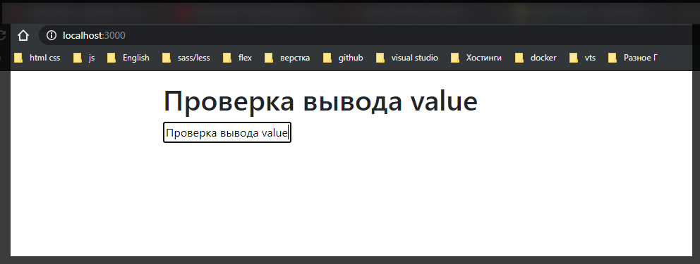
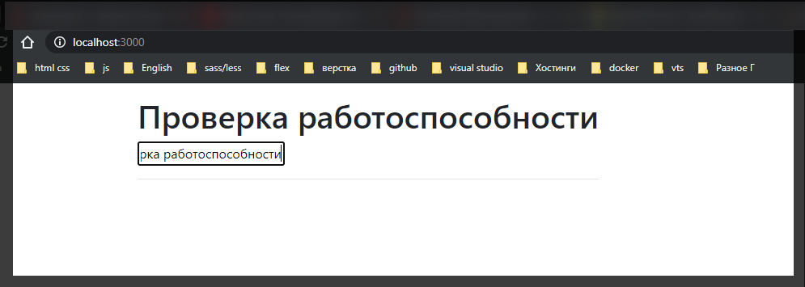
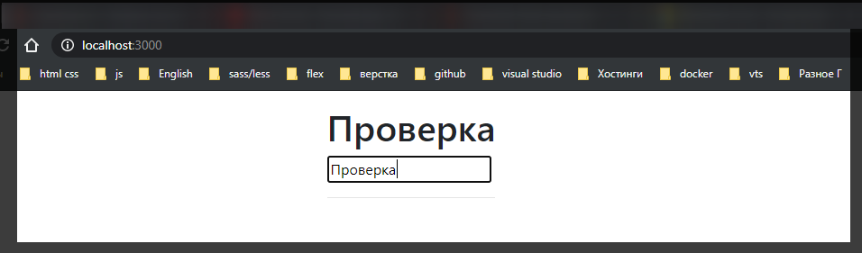
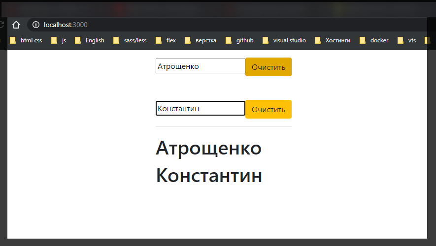

# Создание собственных хуков.

Потренеруемся создавать свои собственные хуки. Потому что в конечном итоге хуки это не что иное как обычные функции. И прелесть заключается в том что с помощью их мы можем создавать любые комбинации. Это позволяет как из конструктора создавать любые участки кода. Оставляю вот такой пустой шаблон.

```jsx
//App.js
import React from 'react';

function App() {
  return (
    <div className={'container pt-3'}>
      <input type="text" />
    </div>
  );
}

export default App;
```

Допустим мы будем взаимодействовать собычным **state**.

```jsx
//App.js
import React, { useState } from 'react';

function App() {
  const [name, setName] = useState('');

  return (
    <div className={'container pt-3'}>
      <input type="text" />
    </div>
  );
}

export default App;
```

Дальше для того что бы корректно с помощью **useState** обрабатывать **input** нам необходимо передать **value** т.е. сам **state** в **value** в нашем случае это **name**. Ну и в **onChange = {changeHandler}** передаю функцию **changeHandler** которую сейчас и создам.

```jsx
//App.js
import React, { useState } from 'react';

function App() {
  const [name, setName] = useState('');

  return (
    <div className={'container pt-3'}>
      <input type="text" value={name} onChange={changeHandler} />
    </div>
  );
}

export default App;
```

C помощью **changeHandler** буду изменять состояние **name**.

В данную функция я принимаю некоторый **event**. И с помощью функции **setName** в которую передаю **event.target.value**

```jsx
//App.js
import React, { useState } from 'react';

function App() {
  const [name, setName] = useState('');

  const changeHandler = (event) => {
    setName(event.target.value);
  };

  return (
    <div className={'container pt-3'}>
      <h1>{name}</h1>
      <input type="text" value={name} onChange={changeHandler} />
    </div>
  );
}

export default App;
```



Как видим проблем ни каких нет. Проблема возникает тогда когда нам нужно добавить несколько **input**.

```jsx
//App.js
import React, { useState } from 'react';

function App() {
  const [name, setName] = useState('');
  const [lastName, setlastName] = useState('');

  const changeHandler = (event) => {
    setName(event.target.value);
  };

  const LastNameHandler = (event) => {
    setName(event.target.value);
  };

  return (
    <div className={'container pt-3'}>
      <h1>{name}</h1>
      <input type="text" value={name} onChange={changeHandler} />
      <input type="text" value={lastName} onChange={LastNameHandler} />
      <hr />
    </div>
  );
}

export default App;
```

В чем заключается идея? Идея заключается в том что много однотипного кода.
Безусловно его можно в некоторой степени оптимизировать. Но чем больше **input-ов** тем больше нам надо будет написать обработчиков. Что не очень удобно.

Весь этот процесс можно улучшить. Показывать буду на примере одного **input**.

Мы создадим два кастомных хука.

Создаю хук как отдельную функцию которая будет следить за изменением какой-то переменной которой мы хотим.

Создаю хук к примеру **useLogger** где в параметрах буду принимать некоторое **value**.

```jsx
//App.js
import React, { useState } from 'react';

function useLogger(value) {}

function App() {
  const [name, setName] = useState('');
  const [lastName, setlastName] = useState('');

  const changeHandler = (event) => {
    setName(event.target.value);
  };

  const LastNameHandler = (event) => {
    setName(event.target.value);
  };

  return (
    <div className={'container pt-3'}>
      <h1>{name}</h1>
      <input type="text" value={name} onChange={changeHandler} />
      <input type="text" value={lastName} onChange={LastNameHandler} />
      <hr />
    </div>
  );
}

export default App;
```

Фишкой создания новых хуков является то внутри мы используем те же самые **react** хуки только уже вне **react** компонента. И для того что бы следить за изменениями какого-то **value** мы пользуемся **useEffect(() =>{})** где в список зависимостей и передаем этот **value**.

```jsx
//App.js
import React, { useEffect, useState } from 'react';

function useLogger(value) {
  useEffect(() => {
    console.log('Value changed', value);
  }, [value]);
}

function App() {
  const [name, setName] = useState('');
  const [lastName, setlastName] = useState('');

  const changeHandler = (event) => {
    setName(event.target.value);
  };

  const LastNameHandler = (event) => {
    setName(event.target.value);
  };

  return (
    <div className={'container pt-3'}>
      <h1>{name}</h1>
      <input type="text" value={name} onChange={changeHandler} />
      <input type="text" value={lastName} onChange={LastNameHandler} />
      <hr />
    </div>
  );
}

export default App;
```

Это пример совершенно базового хука. Его использовать очень просто. Как референс передаю функцию внутри компонета и указываю состояние т.е. **useLogger(name)**.

```jsx
//App.js
import React, { useEffect, useState } from 'react';

function useLogger(value) {
  useEffect(() => {
    console.log('Value changed', value);
  }, [value]);
}

function App() {
  const [name, setName] = useState('');

  const changeHandler = (event) => {
    setName(event.target.value);
  };

  const LastNameHandler = (event) => {
    setName(event.target.value);
  };

  useLogger(name);

  return (
    <div className={'container pt-3'}>
      <h1>{name}</h1>
      <input type="text" value={name} onChange={changeHandler} />
      <hr />
    </div>
  );
}

export default App;
```



Довольно таки удобно для того что бы дебажить.

Понятно что с **const [name, setName] = useState('');** мы разобрались. Как можно этот процесс улучшить?

Я создам новую функцию котороую назову **useInput(){}**. Здесь присутствует большая вариативность т.е. мы сами решаем как использовать данный хук. Рассмотрим базу. Изначально в параметры мы будем принимать некоторый **initialValue**, изначальное состояние. В теле **useInput** создаю локальный **state** который будет отталкиваться от **initialValue**

```jsx
//App.js
import React, { useEffect, useState } from 'react';

function useLogger(value) {
  useEffect(() => {
    console.log('Value changed', value);
  }, [value]);
}

function useValue(initialValue) {
  const [value, setValue] = useState(initialValue);
}

function App() {
  const [name, setName] = useState('');

  const changeHandler = (event) => {
    setName(event.target.value);
  };

  const LastNameHandler = (event) => {
    setName(event.target.value);
  };

  useLogger(name);

  return (
    <div className={'container pt-3'}>
      <h1>{name}</h1>
      <input type="text" value={name} onChange={changeHandler} />
      <hr />
    </div>
  );
}

export default App;
```

И далее useValue по сути мы сами решаем что вернуть в данной функции. Рассмотрим базу. Обратите внимание какие параметры принимает тег **\<input type="text" value={name} onChange={changeHandler} />**. Напоминаю что в react это не тег, это элемент. Этот элемент принимает в себя два параметра **value** и **onChange**. И как раз таки эти вещи мы можем сократить. т.е. в **useValue** я буду возвращать в объекте **value** и **onChange**.

```jsx
//App.js
import React, { useEffect, useState } from 'react';

function useLogger(value) {
  useEffect(() => {
    console.log('Value changed', value);
  }, [value]);
}

function useInput(initialValue) {
  const [value, setValue] = useState(initialValue);
  return {
    value,
    onChange,
  };
}

function App() {
  const [name, setName] = useState('');

  const changeHandler = (event) => {
    setName(event.target.value);
  };

  const LastNameHandler = (event) => {
    setName(event.target.value);
  };

  useLogger(name);

  return (
    <div className={'container pt-3'}>
      <h1>{name}</h1>
      <input type="text" value={name} onChange={changeHandler} />
      <hr />
    </div>
  );
}

export default App;
```

Теперь локально создам функцию onChange. Она будет в себя принимать некоторый **event** и здесь мы будем с помощью функии **setValue** изменять состояние **value** на **event.target.value**

```jsx
//App.js
import React, { useEffect, useState } from 'react';

function useLogger(value) {
  useEffect(() => {
    console.log('Value changed', value);
  }, [value]);
}

function useInput(initialValue) {
  const [value, setValue] = useState(initialValue);

  const onChange = (event) => {
    setValue(event.target.value);
  };
  return {
    value,
    onChange,
  };
}

function App() {
  const [name, setName] = useState('');

  const changeHandler = (event) => {
    setName(event.target.value);
  };

  const LastNameHandler = (event) => {
    setName(event.target.value);
  };

  useLogger(name);

  return (
    <div className={'container pt-3'}>
      <h1>{name}</h1>
      <input type="text" value={name} onChange={changeHandler} />
      <hr />
    </div>
  );
}

export default App;
```

Это абсолютно базовое создание хука **useInput**.

Теперь посмотрим как это работает. Удаляю функцию **changeHandler**. В место ее создаю переменную **input** в которую передаю хук **useInput('')** и указываю начальное состояние пустую строку.

```jsx
//App.js
import React, { useEffect, useState } from 'react';

function useLogger(value) {
  useEffect(() => {
    console.log('Value changed', value);
  }, [value]);
}

function useInput(initialValue) {
  const [value, setValue] = useState(initialValue);

  const onChange = (event) => {
    setValue(event.target.value);
  };
  return {
    value,
    onChange,
  };
}

function App() {
  const input = useInput('');

  useLogger(name);

  return (
    <div className={'container pt-3'}>
      <h1>{name}</h1>
      <input type="text" value={name} onChange={changeHandler} />
      <hr />
    </div>
  );
}

export default App;
```

Теперь это у нас объект **const input = useInput('');** у которого есть значение **value** и **onChange**. Соответственно что бы работал наш **useLogger** я в него могу передать **input.value**. И для того что бы работал весь шаблон в **h1** я могу обратится к **input.value**. и так же в атрибутах я могу указать **input.value** и соответственно **input.onChange**

```jsx
//App.js
import React, { useEffect, useState } from 'react';

function useLogger(value) {
  useEffect(() => {
    console.log('Value changed', value);
  }, [value]);
}

function useInput(initialValue) {
  const [value, setValue] = useState(initialValue);

  const onChange = (event) => {
    setValue(event.target.value);
  };
  return {
    value,
    onChange,
  };
}

function App() {
  const input = useInput('');

  useLogger(input.value);

  return (
    <div className={'container pt-3'}>
      <h1>{input.value}</h1>
      <input type="text" value={input.value} onChange={input.onChange} />
      <hr />
    </div>
  );
}

export default App;
```



Прелестью заключается то что мы назвали ключи **value,onChange,** таким образом что они совпадают с ключами параметров элемента **input**. Поэтому здесь ямогу с помощью **spreed** оператор распарсить данные значения.

```jsx
//App.js
import React, { useEffect, useState } from 'react';

function useLogger(value) {
  useEffect(() => {
    console.log('Value changed', value);
  }, [value]);
}

function useInput(initialValue) {
  const [value, setValue] = useState(initialValue);

  const onChange = (event) => {
    setValue(event.target.value);
  };
  return {
    value,
    onChange,
  };
}

function App() {
  const input = useInput('');

  useLogger(input.value);

  return (
    <div className={'container pt-3'}>
      <h1>{input.value}</h1>
      <input type="text" {...input} />
      <hr />
    </div>
  );
}

export default App;
```

И теперь получается то что функционал остается точно такой же но при этом у нас есть **to the biding**.

Этот код абсолютно универсальный т.е. если мы захотим использовать другой **input** к примеру **lastName**

```jsx
//App.js
import React, { useEffect, useState } from 'react';

function useLogger(value) {
  useEffect(() => {
    console.log('Value changed', value);
  }, [value]);
}

function useInput(initialValue) {
  const [value, setValue] = useState(initialValue);

  const onChange = (event) => {
    setValue(event.target.value);
  };
  return {
    value,
    onChange,
  };
}

function App() {
  const input = useInput('');
  const lastName = useInput('');

  useLogger(input.value);

  return (
    <div className={'container pt-3'}>
      <h1>{input.value}</h1>
      <input type="text" {...input} />
      <input type="text" {...lastName} />
      <hr />
    </div>
  );
}

export default App;
```

Безусловно Мы можем дальше придумывать другие конструкции, например мы можем усложнить. Помимо того что бы будем возвращать базовые значения **value,onChange**, мы будем возвращать функцию **clear**

```jsx
//App.js
import React, { useEffect, useState } from 'react';

function useLogger(value) {
  useEffect(() => {
    console.log('Value changed', value);
  }, [value]);
}

function useInput(initialValue) {
  const [value, setValue] = useState(initialValue);

  const onChange = (event) => {
    setValue(event.target.value);
  };

  const clear = () => {};

  return {
    value,
    onChange,
  };
}

function App() {
  const input = useInput('');
  const lastName = useInput('');

  useLogger(input.value);

  return (
    <div className={'container pt-3'}>
      <h1>{input.value}</h1>
      <h1>{input.lastName}</h1>
      <input type="text" {...input} />
      <input type="text" {...lastName} />
      <hr />
    </div>
  );
}

export default App;
```

Для того что бы ее вернуть мы можем поступить следующим образом. Мы можем вернуть объект **bind** у которого будут значения **value, onChange** т.е. **bind: {value,onChange}**. И здесь мы можем так же экспортировать **value**, и матод **clear**.

```jsx
//App.js
import React, { useEffect, useState } from 'react';

function useLogger(value) {
  useEffect(() => {
    console.log('Value changed', value);
  }, [value]);
}

function useInput(initialValue) {
  const [value, setValue] = useState(initialValue);

  const onChange = (event) => {
    setValue(event.target.value);
  };

  const clear = () => {};

  return {
    bind: {
      value,
      onChange,
    },
    value,
    clear,
  };
}

function App() {
  const input = useInput('');
  const lastName = useInput('');

  useLogger(input.value);

  return (
    <div className={'container pt-3'}>
      <h1>{input.value}</h1>
      <h1>{input.lastName}</h1>
      <input type="text" {...input} />
      <input type="text" {...lastName} />
      <hr />
    </div>
  );
}

export default App;
```

Что мы в итоге получили и как нам это отрефакторить? Теперь для того что бы связать с **input** нам нужно связать с помощью **bind** т.е. **\<input type="text" {...input.bind} />**. Делается это для того что бы элемент **input** не получал ни каких лишних свойств, иначе **jsx** у нас будет ругаться. Когда мы это все группируем в отдельный объект

```jsx
return {
  bind: {
    value,
    onChange,
  },
  value,
  clear,
};
```

и делаем **spreed** по нему

```jsx
<input type="text" {...input.bind} />
```

мы явно указываем что мы связываем эти свойства.

И теперь создаем кнопку

```jsx
//App.js
import React, { useEffect, useState } from 'react';

function useLogger(value) {
  useEffect(() => {
    console.log('Value changed', value);
  }, [value]);
}

function useInput(initialValue) {
  const [value, setValue] = useState(initialValue);

  const onChange = (event) => {
    setValue(event.target.value);
  };

  const clear = () => {};

  return {
    bind: {
      value,
      onChange,
    },
    value,
    clear,
  };
}

function App() {
  const input = useInput('');
  const lastName = useInput('');

  useLogger(input.value);

  return (
    <div className={'container pt-3'}>
      <h1>{input.value}</h1>
      <h1>{input.lastName}</h1>
      <input type="text" {...input.bind} />
      <input type="text" {...lastName} />
      <button className="btn btn-warning" onClick={() => input.clear()}>
        Очистить
      </button>
      <hr />
    </div>
  );
}

export default App;
```

И так полностью два рабочих **input**

```jsx
//App.js
import React, { useEffect, useState } from 'react';

function useLogger(value, lastName) {
  useEffect(() => {
    console.log('Value changed', value, lastName);
  }, [value, lastName]);
}

function useInput(initialValue) {
  const [value, setValue] = useState(initialValue);

  const onChange = (event) => {
    setValue(event.target.value);
  };

  const clear = () => {
    setValue('');
  };

  return {
    bind: {
      value,
      onChange,
    },
    value,
    clear,
  };
}

function App() {
  const input = useInput('');
  const lastName = useInput('');

  useLogger(input.value);

  return (
    <div className={'container pt-3'}>
      <input type="text" {...input.bind} />
      <button className="btn btn-warning" onClick={() => input.clear()}>
        Очистить
      </button>
      <br />
      <br />
      <br />
      <input type="text" {...lastName.bind} />

      <button className="btn btn-warning" onClick={() => lastName.clear()}>
        Очистить
      </button>
      <hr />
      <h1>{input.value}</h1>
      <h1>{lastName.value}</h1>
    </div>
  );
}

export default App;
```


